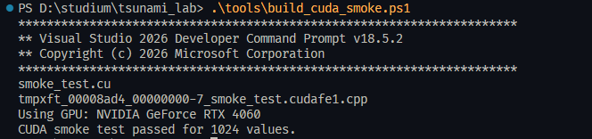

################################################
Submission 10: CUDA Optimierung/Parallelisierung
################################################

10.1 Plan
=========

1. Ziel
-------

In unserer finalen Projektphase möchten wir untersuchen, ob sich unser Tsunami
Simulationsprogramm mithilfe von CUDA auf GPUs beschleunigen lässt. In der vorherigen 
Abgabe haben wir bereits eine OpenMP-Parallelisierung für den zweidimensionalen Solver 
umgesetzt. Dabei lag der Fokus besonders auf WavePropagation2d, da dort ein großer 
Teil der Laufzeit entsteht. Aufbauend darauf möchten wir nun untersuchen, ob sich diese 
rechenintensiven Teile auch effizient auf NVIDIA-GPUs ausführen lassen. 

Unser Ziel ist es nicht, sofort das gesamte Programm inklusive IO, Konfiguration und 
NetCDF-Ausgabe vollständig auf CUDA umzubauen. Stattdessen wollen wir zuerst die 
numerischen Kernkomponenten betrachten. Besonders relevant sind dabei der f-wave 
Solver und die Zeitschrittberechnung im 2D-Patch. Diese Bereiche werden sehr häufig 
ausgeführt und eignen sich deshalb gut für Parallelisierung. 

Am Ende möchten wir vergleichen, wie sich die CUDA-Version gegenüber der bisherigen 
seriellen CPU-Version und der OpenMP-Version verhält. Dabei betrachten wir Laufzeit, 
Speedup, Speicherzugriffe und die Aufteilung der Arbeit zwischen CPU und GPU. 
Motivation Tsunami-Simulationen arbeiten mit großen Gittern. 

Für jedes Zeitschritt-Update müssen viele lokale Berechnungen auf den Zellen oder 
Zellkanten durchgeführt werden. Diese Berechnungen sind teilweise unabhängig 
voneinander und daher grundsätzlich gut parallelisierbar. OpenMP nutzt mehrere CPU
Kerne, während CUDA sehr viele GPU-Threads verwenden kann. Deshalb ist CUDA ein 
sinnvoller nächster Schritt nach unserer OpenMP-Parallelisierung. 

Besonders interessant ist die Frage, ab welcher Problemgröße sich CUDA lohnt. Für 
kleine Gitter kann der GPU-Overhead durch Speichertransfers und Kernel-Starts größer 
sein als der eigentliche Vorteil. Für größere Simulationen wie Tohoku oder Chile könnte 
CUDA jedoch deutliche Vorteile bringen.

2. Meilensteile
---------------

**1. Analyse und CUDA-Grundstruktur**

Zuerst analysieren wir die bestehende OpenMP-Implementierung und entscheiden, 
welcher Programmteil zuerst auf CUDA portiert wird. 

Wahrscheinliche Kandidaten sind: 

* fwave::netUpdates 
* WavePropagation2d::timeStep x- und y-Sweeps im 2D-Solver 

Zusätzlich prüfen wir, wie CUDA in unser bestehendes Build-System eingebunden werden 
kann. Falls eine vollständige Integration in SCons zu aufwendig ist, erstellen wir zunächst 
einen separaten CUDA-Prototyp.

**2. CUDA-Prototyp**

Im zweiten Schritt implementieren wir einen ersten CUDA-Kernel. Dieser soll einen klar 
abgegrenzten rechenintensiven Teil der Simulation übernehmen. Dabei müssen die 
relevanten Arrays auf die GPU kopiert, dort verarbeitet und anschließend wieder zurück 
auf die CPU übertragen werden. 

Mögliche erste Implementierung: viele unabhängige f-wave Updates parallel auf der GPU 
berechnen oder einen vereinfachten 2D-Sweep auf der GPU ausführen.

**3. Tests und Korrektheit**

Für alle geänderten oder neu implementierten Teile sollen Tests oder 
Plausibilitätsprüfungen durchgeführt werden. Die CUDA-Ergebnisse werden mit der 
bestehenden CPU-Version verglichen. Wegen Floating-Point-Unterschieden erwarten wir 
keine vollständig bitgenauen Ergebnisse, aber die Abweichungen sollten klein und 
erklärbar sein.

**4. Simulationsdurchführung**

Nach dem CUDA-Prototyp testen wir verschiedene Szenarien. Zunächst verwenden wir 
kleinere künstliche Setups, weil diese einfacher zu debuggen sind. Danach können wir, 
falls die CUDA-Version stabil läuft, größere Szenarien testen: 

* Tohoku in grober Auflösung
* Chile in grober Auflösung
* optional verschiedene Gittergrößen, z.B. 500 x 500, 1000 x 1000, 2000 x 2000

**5. Optimierung und Analyse**

Nach den ersten Simulationsläufen analysieren wir mögliche Performance-Probleme. 
Dabei betrachten wir: 

* Speichertransfers zwischen CPU und GPU
* Speicherzugriffsmuster auf der GPU
* Arbeitsverteilung auf GPU-Threads 
* mögliche Bottlenecks im Kernel
* Vergleich mit den bisherigen OpenMP-Hotspots 

Falls möglich, nutzen wir Profiling-Werkzeuge wie NVIDIA Nsight oder andere verfügbare 
Tools. VTune ist eher für CPU/OpenMP hilfreich, für CUDA wären NVIDIA-Tools 
wahrscheinlich passender.

**6. Vergleich CUDA vs. CPU/OpenMP**

Am Ende vergleichen wir: 

* serielle CPU-Version
* OpenMP-Version
* CUDA-Version.

Wichtige Vergleichsgrößen: 

* Laufzeit der Zeitschritt-Schleife 
* Speedup 
* Cell updates per second 
* Speichertransferkosten 
* Skalierung mit steigender Gittergröße 
* Genauigkeit bzw. Plausibilität der Ergebnisse

3. Work Packages
----------------

**WP1: Analyse der bestehenden OpenMP-Version**

Wir untersuchen, welche Teile der bisherigen OpenMP-Version für CUDA geeignet sind. 
Dabei konzentrieren wir uns besonders auf WavePropagation2d und den f-wave Solver. 

**WP2: CUDA-Setup und Build** 

Wir prüfen die CUDA-Umgebung und binden CUDA entweder direkt in das Build-System 
ein oder erstellen zunächst einen separaten Prototyp. Ziel ist, CUDA-Code zuverlässig 
kompilieren und ausführen zu können. 

**WP3: CUDA-Kernel-Implementierung**

Wir implementieren einen ersten CUDA-Kernel für einen numerischen Kern der 
Simulation. Dabei achten wir auf sinnvolle Thread- und Blockgrößen sowie auf möglichst 
einfache und nachvollziehbare Speicherzugriffe. 

**WP4: Datenübertragung und Speicherverwaltung**

Wir verwalten GPU-Speicher für die relevanten Arrays, z.B. Wasserhöhe, Impuls und 
Bathymetrie. Außerdem untersuchen wir, wie oft Daten zwischen CPU und GPU kopiert 
werden müssen. 

**WP5: Tests und Ergebnisvergleich**

Die CUDA-Ergebnisse werden mit der CPU-Version verglichen. Dabei prüfen wir, ob die 
Werte plausibel bleiben und ob numerische Abweichungen akzeptabel sind. 

**WP6: Benchmarking**

Wir messen die Laufzeiten verschiedener Varianten und erstellen Tabellen oder Plots für 
CPU, OpenMP und CUDA. Dabei testen wir verschiedene Gittergrößen und eventuell 
verschiedene Szenarien. 

**WP7: Dokumentation und Präsentation**

Wir dokumentieren die Implementierung, die Messergebnisse, Probleme und Grenzen. 
Außerdem bereiten wir die Statuspräsentationen und die finale Präsentation vor. 

4. Zeitplan
-----------

**Bis 25.06. – 1. Statuspräsentation**

*Ziele:*

* OpenMP-Arbeit als Ausgangspunkt zusammenfassen 
* CUDA-Ziel und technischen Fokus festlegen
* relevante Codebereiche analysieren 
* CUDA Toolkit / GPU-Umgebung prüfen 
* ersten kleinen CUDA-Testkernel erstellen 
* entscheiden, ob zuerst fwave::netUpdates oder ein Teil von WavePropagation2d::timeStep portiert wird 

*Präsentierbares Ergebnis:*

* Projektziel geplanter CUDA-Fokus 
* erste technische Einschätzung Risiken und nächster Schritt 

**Bis 02.07. – 2. Statuspräsentation** 

*Ziele:*

* ersten CUDA-Prototyp implementieren 
* Speicher auf GPU allokieren 
* Daten CPU → GPU und GPU → CPU übertragen 
* ersten numerischen Kernel ausführen 
* Ergebnisse mit CPU-Version vergleichen 
* erste kleine Laufzeitmessungen durchführen 

*Präsentierbares Ergebnis:*

* erster CUDA-Prototyp Beispielvergleich CPU vs. CUDA 
* erste Probleme oder Erkenntnisse Plan für finale Benchmarks

**Bis 09.07. – Finale Präsentation**

*Ziele:*

* CUDA-Version benchmarken 
* Vergleich: CPU seriell vs. OpenMP vs. CUDA 
* verschiedene Gittergrößen testen 
* Speedup berechnen 
* Speichertransferkosten diskutieren 
* Grenzen der Implementierung erklären 
* mögliche weitere Optimierungen nennen 

*Präsentierbares Ergebnis:*

* finale Laufzeittabellen 
* Speedup-Vergleich 
* Bewertung, ob CUDA für unsere Simulation sinnvoll ist 
* Lessons Learned 

**Bis 31.07. – Finale Abgabe**

*Ziele:*

* Bugfixes, Code aufräumen 
* Dokumentation vervollständigen
* finale Tabellen und Plots ergänzen  und schriftliche Auswertung fertigstellen 
* Tests finalisieren

5. Risiken
----------

Ein hohes Risiko ist, dass die vollständige CUDA-Integration in das bestehende Programm 
zu aufwendig wird. Deshalb planen wir zuerst einen begrenzten CUDA-Prototyp für einen 
klar definierten Rechenkern. 

Ein weiteres Risiko sind Speichertransfers zwischen CPU und GPU. Wenn zu viele Daten 
pro Zeitschritt kopiert werden müssen, kann der Speedup stark reduziert werden. 
Außerdem ist das aktuelle Datenlayout eventuell nicht optimal für GPU-Zugriffe. CUDA 
profitiert von zusammenhängenden und gut strukturierten Speicherzugriffen. Falls die 
Speicherzugriffe ungünstig sind, kann die GPU trotz vieler Threads ineffizient arbeiten. 

Die Korrektheit ist auch ein Risiko. Durch andere Ausführungsreihenfolgen und Floating
Point-Unterschiede können CUDA-Ergebnisse leicht von CPU-Ergebnissen abweichen. 
Diese Unterschiede müssen analysiert und eingeordnet werden. 

6. Erwartetes Ergebnis
----------------------

Am Ende erwarten wir eine Einschätzung, ob CUDA für unsere Tsunami-Simulation 
sinnvoll ist. Im besten Fall erreichen wir einen messbaren Speedup gegenüber der 
seriellen CPU-Version und können CUDA auch mit OpenMP vergleichen. Falls der 
Speedup kleiner ausfällt als erwartet, ist das trotzdem ein wichtiges Ergebnis, weil wir 
dann besser verstehen, welche Teile unseres Codes GPU-freundlich sind und welche 
Änderungen für zukünftige Optimierungen notwendig wären. 

7. Ressourcen
-------------

* `CUDA Toolkit <https://developer.nvidia.com/cuda/toolkit>`
* `NVIDIA CUDA Dokumentation <https://docs.nvidia.com/cuda/>`
* bestehende OpenMP-Implementierung aus Submission 9 
* bestehende Benchmark-Szenarien Tohoku und Chile 
* vorhandene Laufzeitmessungen der Zeitschritt-Schleife 

10.2 Erstes Status-Update (18.06. bis 25.06.)
=============================================

1. Vorgenommene Ziele
---------------------

* OpenMP-Arbeit als Ausgangspunkt zusammenfassen 
* CUDA-Ziel und technischen Fokus festlegen
* relevante Codebereiche analysieren 
* CUDA Toolkit / GPU-Umgebung prüfen 
* ersten kleinen CUDA-Testkernel erstellen 
* entscheiden, ob zuerst fwave::netUpdates oder ein Teil von WavePropagation2d::timeStep portiert wird

2. OpenMP Ausgangspunkt und OpenMP-Hotspots des parallelisierten Programms
--------------------------------------------------------------------------

Da wir uns nun vorgenommen haben mit CUDA zu parallelisieren und zu optimieren, 
wollten wir vorher analysieren, welche Hotspots bei der OpenMP-Version auffallen. 
Dazu haben wir mit VTune eine Hotspots-Analyse durchgeführt für Tohoku mit 2500m Auflösung. 
Dabei führten wir unsere Simulation mit 16 Threads, mit ``static`` schedule und ``close`` binding. 

.. figure:: ../_static/vtune-para-hotspots-summary1.png
  :width: 70%
  :align: center
  
  Zusammenfassung: Zeit und Top Hotspots

Hier sehen wir, dass unsere ``fwave::netUpdates`` Funktion weiterhin die aktivste Funktion ist, und somit zuerst portiert werden sollte. 
Danach kommt zusammengefasst unsere ``WavePropagation2d::timeStep``, welche die Momenta in x- und y-Richtung berechnet. 

.. figure:: ../_static/vtune-para-hotspots-summary2.png
  :width: 70%
  :align: center
  
  Zusammenfassung: Histogramm von effektiver CPU Nutzung

Vermutlich auch zu verbessern mit höherer Thread-Anzahl.

.. figure:: ../_static/vtune-para-hotspots-bottomup.png
  :width: 70%
  :align: center
  
  Bottom-Up Graph von den Funktionen und deren CPU Laufzeit

Auch hier sehen wir wieder, dass ``fwave::netUpdates``, ``WavePropagation2d::computeYImpulse`` 
und ``WavePropagation2d::computeXImpulse`` die meiste CPU-Zeit einnimmt. 

.. figure:: ../_static/vtune-para-hotspots-flamegraph.png
  :width: 70%
  :align: center
  
  Flame-Graph des Programms

Insgesamt haben wir die richtigen Punkte in unserem Simulationsprogramm parallelisiert und haben so einen guten Ausgangspunkt, 
an dem wir uns für die CUDA-Optimierung orientieren können. 

3. Festlegung zuerst fwave::netUpdates zu portieren
---------------------------------------------------

Der aktuelle zweidimensionale Solver, wodrin auch die aktivsten Funktionen implementiert sind, liegt hier:

* ``src/patches/wavepropagation2d/WavePropagation2d.cpp``
* ``src/patches/wavepropagation2d/WavePropagation2d.h``
* ``src/solvers/FWave.cpp``
* ``src/solvers/fwave.h``

``WavePropagation2d::timeStep`` arbeitet aktuell in zwei Richtungen:

1. alte Arrays in den nächsten Buffer kopieren,
2. Kanten-Updates in x-Richtung berechnen,
3. Ghost Cells aktualisieren,
4. erneut kopieren,
5. Kanten-Updates in y-Richtung berechnen,
6. Ghost Cells erneut aktualisieren.

Der rechenintensive Teil liegt in den x- und y-Kantenschleifen. Jede Kante ruft
entweder ``Roe::netUpdates`` oder ``fwave::netUpdates`` auf. Beim f-wave Solver wird
dieselbe lokale Berechnung für viele voneinander unabhängige Kanten wiederholt.

Da ``WavePropagation2d::timeStep`` zweimal pro Zeitschritt ``netUpdates`` aufruft, haben wir 
folgende Entscheidung getroffen.

Der empfohlene erste numerische CUDA-Prototyp ist eine Batch-Version von
``fwave::netUpdates``, nicht sofort das gesamte ``WavePropagation2d::timeStep``.

Gründe:

* ``fwave::netUpdates`` ist ein kleiner, klar abgegrenzter numerischer Kern.
* Ein CUDA-Thread kann genau ein Kanten-Update berechnen.
* Eingaben und Ausgaben sind einfache ``float``-Arrays. Dadurch lässt sich die
  CUDA-Version gut mit der CPU-Version vergleichen.
* Man muss sich am Anfang noch nicht mit dem kompletten Buffer-Wechsel,
  Ghost-Cell-Updates und möglichen Schreibkonflikten zwischen Nachbarzellen
  beschäftigen.

``WavePropagation2d::timeStep`` sollte erst danach portiert werden, wenn der
batched f-wave Kernel korrekt funktioniert. Der vollständige Zeitschritt ist
zwar das eigentliche Performance-Ziel, hat aber mehr bewegliche Teile und ist
deshalb als erster CUDA-Schritt riskanter.

4. Aktuelle lokale Umgebung und Einrichtung von CUDA
----------------------------------------------------

Da wir nun mit CUDA arbeiten wollen, ist es auch wichtig NVIDIA Grafikkarten zu haben. Wir werden einmal die folgende angegeben GPU nutzen, 
sowie auch auf das Draco Cluster zugreifen, um mehr Vergleichspunkte zu haben. 

* GPU mit ``nvidia-smi`` erkannt: NVIDIA GeForce RTX 4060, 8 GB VRAM.
* NVIDIA-Treiber erkannt: 596.49.
* Der Treiber meldet CUDA-Laufzeitunterstützung bis Version 13.2.
* CUDA Toolkit über ``winget`` installiert: ``Nvidia.CUDA`` Version 13.3.
* CUDA-Compiler installiert:
  ``C:\Program Files\NVIDIA GPU Computing Toolkit\CUDA\v13.3\bin\nvcc.exe``.
* ``nvcc --version``: CUDA compilation tools release 13.3, V13.3.33.
* Visual Studio Build Tools sind installiert, aber ``cl.exe`` liegt nicht im
  normalen PowerShell-`PATH`. Das Smoke-Test-Skript lädt die Visual-Studio-
  Build-Tools-Umgebung deshalb automatisch.
* Die lokale RTX 4060 ist eine Ada-GPU. Das Smoke-Test-Skript verwendet
  ``-arch=sm_89``, damit ``nvcc`` nativen Code für diese GPU erzeugt und nicht auf
  PTX-JIT-Kompilierung durch den Treiber angewiesen ist.
* Ergebnis des Smoke-Tests: ``CUDA smoke test passed for 1024 values.``

Wichtiger Unterschied: ``nvidia-smi`` bestätigt, dass der Treiber die GPU sieht.
Das bedeutet aber noch nicht automatisch, dass CUDA-Code kompiliert werden kann.
Dafür braucht man das CUDA Toolkit, besonders ``nvcc.exe``.

Mit dem CUDA-Toolkit wurde CUDA dann auf dem lokalen PC eingerichtet. 
Mehr Informationen dazu auch nochmal in ``docs/cuda_plan.md``, 
die meisten Informationen überdecken sich mit den hier angegeben, jedoch gibt es Details zu CUDA Einrichtung auf Windows. 

5. CUDA-Testkernel
------------------

Die Datei ``cuda/smoke_test.cu`` enthält einen minimalen CUDA-Kernel:

* drei Arrays auf der GPU allokieren,
* Eingabedaten von der CPU auf die GPU kopieren,
* einen Kernel mit vielen CUDA-Threads starten,
* das Ergebnis zurück auf die CPU kopieren,
* jedes Ergebnis mit der CPU-Erwartung vergleichen.

Dieser Test ist bewusst unabhängig von SCons. Er beantwortet zuerst die
Grundfrage: "Kann diese Maschine CUDA-Code kompilieren und ausführen?"

  
  Ausgabe nach smoke_test.cu Lauf

Nach dem erfolgreichen CUDA-Smoke-Test beschäftigen wir uns mit:

1. CUDA-Variante ``fwaveNetUpdatesKernel`` erstellen, bei der jeder Thread eine
   Kante berechnet,
2. CPU-Testarrays mit mehreren Kanten-Zuständen vorbereiten,
3. CPU-Version ``fwave::netUpdates`` und CUDA-Version ausführen,
4. Ergebnisarrays mit einer kleinen Floating-Point-Toleranz vergleichen,
5. erst danach den Kernel in ``WavePropagation2d`` einbinden.

10.3 Zweites Status-Update (25.06. bis 02.07.)
==============================================

1. Vorgenommene Ziele
---------------------

* ersten CUDA-Prototyp implementieren 
* Speicher auf GPU allokieren 
* Daten CPU → GPU und GPU → CPU übertragen 
* ersten numerischen Kernel ausführen 
* Ergebnisse mit CPU-Version vergleichen 
* erste kleine Laufzeitmessungen durchführen 