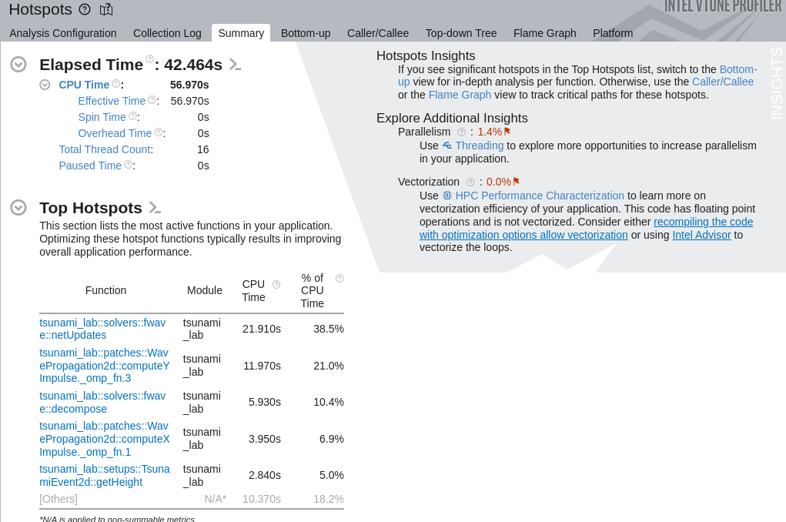
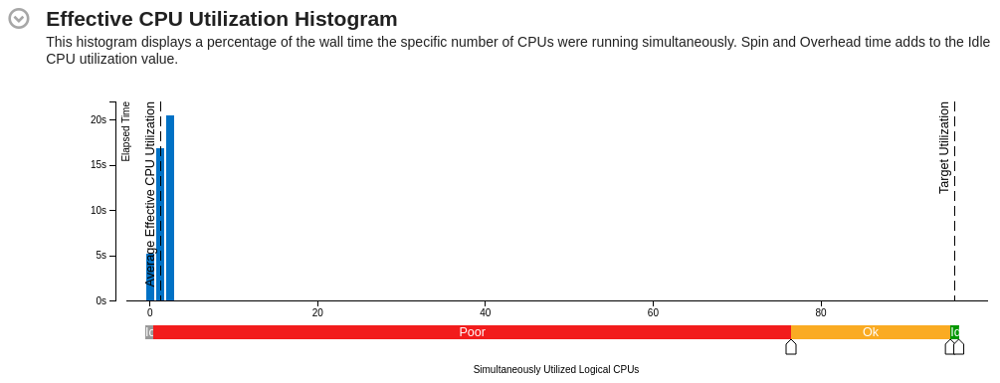
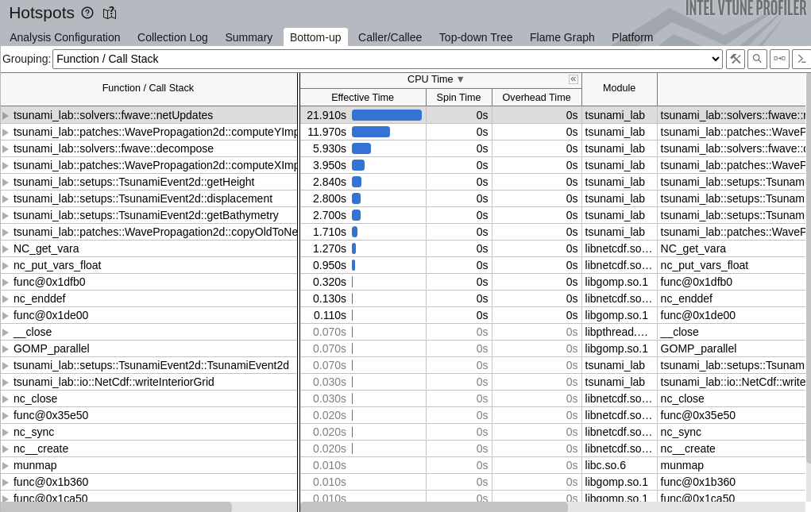
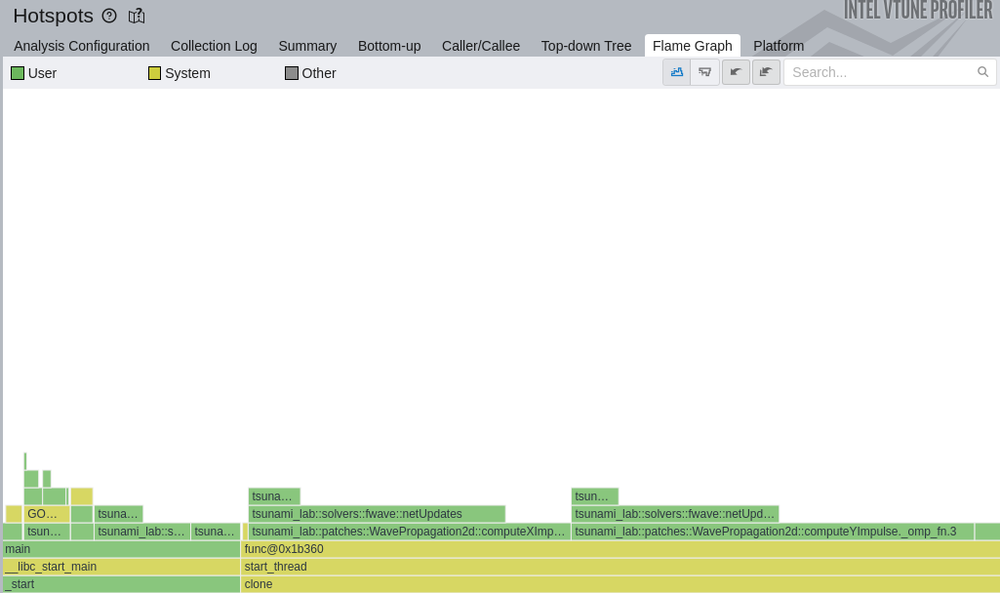

################################################
Submission 10: CUDA Optimierung/Parallelisierung
################################################

10.1 Plan
=========

1. Ziel
-------

In unserer finalen Projektphase möchten wir untersuchen, ob sich unser Tsunami
Simulationsprogramm mithilfe von CUDA auf GPUs beschleunigen lässt. In der vorherigen 
Abgabe haben wir bereits eine OpenMP-Parallelisierung für den zweidimensionalen Solver 
umgesetzt. Dabei lag der Fokus besonders auf WavePropagation2d, da dort ein großer 
Teil der Laufzeit entsteht. Aufbauend darauf möchten wir nun untersuchen, ob sich diese 
rechenintensiven Teile auch effizient auf NVIDIA-GPUs ausführen lassen. 

Unser Ziel ist es nicht, sofort das gesamte Programm inklusive IO, Konfiguration und 
NetCDF-Ausgabe vollständig auf CUDA umzubauen. Stattdessen wollen wir zuerst die 
numerischen Kernkomponenten betrachten. Besonders relevant sind dabei der f-wave 
Solver und die Zeitschrittberechnung im 2D-Patch. Diese Bereiche werden sehr häufig 
ausgeführt und eignen sich deshalb gut für Parallelisierung. 

Am Ende möchten wir vergleichen, wie sich die CUDA-Version gegenüber der bisherigen 
seriellen CPU-Version und der OpenMP-Version verhält. Dabei betrachten wir Laufzeit, 
Speedup, Speicherzugriffe und die Aufteilung der Arbeit zwischen CPU und GPU. 
Motivation Tsunami-Simulationen arbeiten mit großen Gittern. 

Für jedes Zeitschritt-Update müssen viele lokale Berechnungen auf den Zellen oder 
Zellkanten durchgeführt werden. Diese Berechnungen sind teilweise unabhängig 
voneinander und daher grundsätzlich gut parallelisierbar. OpenMP nutzt mehrere CPU
Kerne, während CUDA sehr viele GPU-Threads verwenden kann. Deshalb ist CUDA ein 
sinnvoller nächster Schritt nach unserer OpenMP-Parallelisierung. 

Besonders interessant ist die Frage, ab welcher Problemgröße sich CUDA lohnt. Für 
kleine Gitter kann der GPU-Overhead durch Speichertransfers und Kernel-Starts größer 
sein als der eigentliche Vorteil. Für größere Simulationen wie Tohoku oder Chile könnte 
CUDA jedoch deutliche Vorteile bringen.

2. Meilensteile
---------------

**1. Analyse und CUDA-Grundstruktur**

Zuerst analysieren wir die bestehende OpenMP-Implementierung und entscheiden, 
welcher Programmteil zuerst auf CUDA portiert wird. 

Wahrscheinliche Kandidaten sind: 

* fwave::netUpdates 
* WavePropagation2d::timeStep x- und y-Sweeps im 2D-Solver 

Zusätzlich prüfen wir, wie CUDA in unser bestehendes Build-System eingebunden werden 
kann. Falls eine vollständige Integration in SCons zu aufwendig ist, erstellen wir zunächst 
einen separaten CUDA-Prototyp.

**2. CUDA-Prototyp**

Im zweiten Schritt implementieren wir einen ersten CUDA-Kernel. Dieser soll einen klar 
abgegrenzten rechenintensiven Teil der Simulation übernehmen. Dabei müssen die 
relevanten Arrays auf die GPU kopiert, dort verarbeitet und anschließend wieder zurück 
auf die CPU übertragen werden. 

Mögliche erste Implementierung: viele unabhängige f-wave Updates parallel auf der GPU 
berechnen oder einen vereinfachten 2D-Sweep auf der GPU ausführen.

**3. Tests und Korrektheit**

Für alle geänderten oder neu implementierten Teile sollen Tests oder 
Plausibilitätsprüfungen durchgeführt werden. Die CUDA-Ergebnisse werden mit der 
bestehenden CPU-Version verglichen. Wegen Floating-Point-Unterschieden erwarten wir 
keine vollständig bitgenauen Ergebnisse, aber die Abweichungen sollten klein und 
erklärbar sein.

**4. Simulationsdurchführung**

Nach dem CUDA-Prototyp testen wir verschiedene Szenarien. Zunächst verwenden wir 
kleinere künstliche Setups, weil diese einfacher zu debuggen sind. Danach können wir, 
falls die CUDA-Version stabil läuft, größere Szenarien testen: 

* Tohoku in grober Auflösung
* Chile in grober Auflösung
* optional verschiedene Gittergrößen, z.B. 500 x 500, 1000 x 1000, 2000 x 2000

**5. Optimierung und Analyse**

Nach den ersten Simulationsläufen analysieren wir mögliche Performance-Probleme. 
Dabei betrachten wir: 

* Speichertransfers zwischen CPU und GPU
* Speicherzugriffsmuster auf der GPU
* Arbeitsverteilung auf GPU-Threads 
* mögliche Bottlenecks im Kernel
* Vergleich mit den bisherigen OpenMP-Hotspots 

Falls möglich, nutzen wir Profiling-Werkzeuge wie NVIDIA Nsight oder andere verfügbare 
Tools. VTune ist eher für CPU/OpenMP hilfreich, für CUDA wären NVIDIA-Tools 
wahrscheinlich passender.

**6. Vergleich CUDA vs. CPU/OpenMP**

Am Ende vergleichen wir: 

* serielle CPU-Version
* OpenMP-Version
* CUDA-Version.

Wichtige Vergleichsgrößen: 

* Laufzeit der Zeitschritt-Schleife 
* Speedup 
* Cell updates per second 
* Speichertransferkosten 
* Skalierung mit steigender Gittergröße 
* Genauigkeit bzw. Plausibilität der Ergebnisse

3. Work Packages
----------------

**WP1: Analyse der bestehenden OpenMP-Version**

Wir untersuchen, welche Teile der bisherigen OpenMP-Version für CUDA geeignet sind. 
Dabei konzentrieren wir uns besonders auf WavePropagation2d und den f-wave Solver. 

**WP2: CUDA-Setup und Build** 

Wir prüfen die CUDA-Umgebung und binden CUDA entweder direkt in das Build-System 
ein oder erstellen zunächst einen separaten Prototyp. Ziel ist, CUDA-Code zuverlässig 
kompilieren und ausführen zu können. 

**WP3: CUDA-Kernel-Implementierung**

Wir implementieren einen ersten CUDA-Kernel für einen numerischen Kern der 
Simulation. Dabei achten wir auf sinnvolle Thread- und Blockgrößen sowie auf möglichst 
einfache und nachvollziehbare Speicherzugriffe. 

**WP4: Datenübertragung und Speicherverwaltung**

Wir verwalten GPU-Speicher für die relevanten Arrays, z.B. Wasserhöhe, Impuls und 
Bathymetrie. Außerdem untersuchen wir, wie oft Daten zwischen CPU und GPU kopiert 
werden müssen. 

**WP5: Tests und Ergebnisvergleich**

Die CUDA-Ergebnisse werden mit der CPU-Version verglichen. Dabei prüfen wir, ob die 
Werte plausibel bleiben und ob numerische Abweichungen akzeptabel sind. 

**WP6: Benchmarking**

Wir messen die Laufzeiten verschiedener Varianten und erstellen Tabellen oder Plots für 
CPU, OpenMP und CUDA. Dabei testen wir verschiedene Gittergrößen und eventuell 
verschiedene Szenarien. 

**WP7: Dokumentation und Präsentation**

Wir dokumentieren die Implementierung, die Messergebnisse, Probleme und Grenzen. 
Außerdem bereiten wir die Statuspräsentationen und die finale Präsentation vor. 

4. Zeitplan
-----------

**Bis 25.06. – 1. Statuspräsentation**

*Ziele:*

* OpenMP-Arbeit als Ausgangspunkt zusammenfassen 
* CUDA-Ziel und technischen Fokus festlegen
* relevante Codebereiche analysieren 
* CUDA Toolkit / GPU-Umgebung prüfen 
* ersten kleinen CUDA-Testkernel erstellen 
* entscheiden, ob zuerst fwave::netUpdates oder ein Teil von WavePropagation2d::timeStep portiert wird 

*Präsentierbares Ergebnis:*

* Projektziel geplanter CUDA-Fokus 
* erste technische Einschätzung Risiken und nächster Schritt 

**Bis 02.07. – 2. Statuspräsentation** 

*Ziele:*

* ersten CUDA-Prototyp implementieren 
* Speicher auf GPU allokieren 
* Daten CPU → GPU und GPU → CPU übertragen 
* ersten numerischen Kernel ausführen 
* Ergebnisse mit CPU-Version vergleichen 
* erste kleine Laufzeitmessungen durchführen 

*Präsentierbares Ergebnis:*

* erster CUDA-Prototyp Beispielvergleich CPU vs. CUDA 
* erste Probleme oder Erkenntnisse Plan für finale Benchmarks

**Bis 09.07. – Finale Präsentation**

*Ziele:*

* CUDA-Version benchmarken 
* Vergleich: CPU seriell vs. OpenMP vs. CUDA 
* verschiedene Gittergrößen testen 
* Speedup berechnen 
* Speichertransferkosten diskutieren 
* Grenzen der Implementierung erklären 
* mögliche weitere Optimierungen nennen 

*Präsentierbares Ergebnis:*

* finale Laufzeittabellen 
* Speedup-Vergleich 
* Bewertung, ob CUDA für unsere Simulation sinnvoll ist 
* Lessons Learned 

**Bis 31.07. – Finale Abgabe**

*Ziele:*

* Bugfixes, Code aufräumen 
* Dokumentation vervollständigen
* finale Tabellen und Plots ergänzen  und schriftliche Auswertung fertigstellen 
* Tests finalisieren

5. Risiken
----------

Ein hohes Risiko ist, dass die vollständige CUDA-Integration in das bestehende Programm 
zu aufwendig wird. Deshalb planen wir zuerst einen begrenzten CUDA-Prototyp für einen 
klar definierten Rechenkern. 

Ein weiteres Risiko sind Speichertransfers zwischen CPU und GPU. Wenn zu viele Daten 
pro Zeitschritt kopiert werden müssen, kann der Speedup stark reduziert werden. 
Außerdem ist das aktuelle Datenlayout eventuell nicht optimal für GPU-Zugriffe. CUDA 
profitiert von zusammenhängenden und gut strukturierten Speicherzugriffen. Falls die 
Speicherzugriffe ungünstig sind, kann die GPU trotz vieler Threads ineffizient arbeiten. 

Die Korrektheit ist auch ein Risiko. Durch andere Ausführungsreihenfolgen und Floating
Point-Unterschiede können CUDA-Ergebnisse leicht von CPU-Ergebnissen abweichen. 
Diese Unterschiede müssen analysiert und eingeordnet werden. 

6. Erwartetes Ergebnis
----------------------

Am Ende erwarten wir eine Einschätzung, ob CUDA für unsere Tsunami-Simulation 
sinnvoll ist. Im besten Fall erreichen wir einen messbaren Speedup gegenüber der 
seriellen CPU-Version und können CUDA auch mit OpenMP vergleichen. Falls der 
Speedup kleiner ausfällt als erwartet, ist das trotzdem ein wichtiges Ergebnis, weil wir 
dann besser verstehen, welche Teile unseres Codes GPU-freundlich sind und welche 
Änderungen für zukünftige Optimierungen notwendig wären. 

7. Ressourcen
-------------

* `CUDA Toolkit <https://developer.nvidia.com/cuda/toolkit>`
* `NVIDIA CUDA Dokumentation <https://docs.nvidia.com/cuda/>`
* bestehende OpenMP-Implementierung aus Submission 9 
* bestehende Benchmark-Szenarien Tohoku und Chile 
* vorhandene Laufzeitmessungen der Zeitschritt-Schleife 

10.2 Erstes Status-Update (18.06. bis 25.06.)
=============================================

1. Vorgenommene Ziele
---------------------

* OpenMP-Arbeit als Ausgangspunkt zusammenfassen 
* CUDA-Ziel und technischen Fokus festlegen
* relevante Codebereiche analysieren 
* CUDA Toolkit / GPU-Umgebung prüfen 
* ersten kleinen CUDA-Testkernel erstellen 
* entscheiden, ob zuerst fwave::netUpdates oder ein Teil von WavePropagation2d::timeStep portiert wird

2. OpenMP Ausgangspunkt und OpenMP-Hotspots des parallelisierten Programms
--------------------------------------------------------------------------

Da wir uns nun vorgenommen haben mit CUDA zu parallelisieren und zu optimieren, 
wollten wir vorher analysieren, welche Hotspots bei der OpenMP-Version auffallen. 
Dazu haben wir mit VTune eine Hotspots-Analyse durchgeführt für Tohoku mit 2500m Auflösung. 
Dabei führten wir unsere Simulation mit 16 Threads, mit ``static`` schedule und ``close`` binding. 

  
  Zusammenfassung: Zeit und Top Hotspots

Hier sehen wir, dass unsere ``fwave::netUpdates`` Funktion weiterhin die aktivste Funktion ist, und somit zuerst portiert werden sollte. 
Danach kommt zusammengefasst unsere ``WavePropagation2d::timeStep``, welche die Momenta in x- und y-Richtung berechnet. 

  
  Zusammenfassung: Histogramm von effektiver CPU Nutzung

Vermutlich auch zu verbessern mit höherer Thread-Anzahl.

  
  Bottom-Up Graph von den Funktionen und deren CPU Laufzeit

Auch hier sehen wir wieder, dass ``fwave::netUpdates``, ``WavePropagation2d::computeYImpulse`` 
und ``WavePropagation2d::computeXImpulse`` die meiste CPU-Zeit einnimmt. 

  
  Flame-Graph des Programms

Insgesamt haben wir die richtigen Punkte in unserem Simulationsprogramm parallelisiert und haben so einen guten Ausgangspunkt, 
an dem wir uns für die CUDA-Optimierung orientieren können. 

3. Festlegung zuerst fwave::netUpdates zu portieren
---------------------------------------------------

Der aktuelle zweidimensionale Solver, wodrin auch die aktivsten Funktionen implementiert sind, liegt hier:

* ``src/patches/wavepropagation2d/WavePropagation2d.cpp``
* ``src/patches/wavepropagation2d/WavePropagation2d.h``
* ``src/solvers/FWave.cpp``
* ``src/solvers/fwave.h``

``WavePropagation2d::timeStep`` arbeitet aktuell in zwei Richtungen:

1. alte Arrays in den nächsten Buffer kopieren,
2. Kanten-Updates in x-Richtung berechnen,
3. Ghost Cells aktualisieren,
4. erneut kopieren,
5. Kanten-Updates in y-Richtung berechnen,
6. Ghost Cells erneut aktualisieren.

Der rechenintensive Teil liegt in den x- und y-Kantenschleifen. Jede Kante ruft
entweder ``Roe::netUpdates`` oder ``fwave::netUpdates`` auf. Beim f-wave Solver wird
dieselbe lokale Berechnung für viele voneinander unabhängige Kanten wiederholt.

Da ``WavePropagation2d::timeStep`` zweimal pro Zeitschritt ``netUpdates`` aufruft, haben wir 
folgende Entscheidung getroffen.

Der empfohlene erste numerische CUDA-Prototyp ist eine Batch-Version von
``fwave::netUpdates``, nicht sofort das gesamte ``WavePropagation2d::timeStep``.

Gründe:

* ``fwave::netUpdates`` ist ein kleiner, klar abgegrenzter numerischer Kern.
* Ein CUDA-Thread kann genau ein Kanten-Update berechnen.
* Eingaben und Ausgaben sind einfache ``float``-Arrays. Dadurch lässt sich die
  CUDA-Version gut mit der CPU-Version vergleichen.
* Man muss sich am Anfang noch nicht mit dem kompletten Buffer-Wechsel,
  Ghost-Cell-Updates und möglichen Schreibkonflikten zwischen Nachbarzellen
  beschäftigen.

``WavePropagation2d::timeStep`` sollte erst danach portiert werden, wenn der
batched f-wave Kernel korrekt funktioniert. Der vollständige Zeitschritt ist
zwar das eigentliche Performance-Ziel, hat aber mehr bewegliche Teile und ist
deshalb als erster CUDA-Schritt riskanter.

4. Aktuelle lokale Umgebung und Einrichtung von CUDA
----------------------------------------------------

Da wir nun mit CUDA arbeiten wollen, ist es auch wichtig NVIDIA Grafikkarten zu haben. Wir werden einmal die folgende angegeben GPU nutzen, 
sowie auch auf das Draco Cluster zugreifen, um mehr Vergleichspunkte zu haben. 

* GPU mit ``nvidia-smi`` erkannt: NVIDIA GeForce RTX 4060, 8 GB VRAM.
* NVIDIA-Treiber erkannt: 596.49.
* Der Treiber meldet CUDA-Laufzeitunterstützung bis Version 13.2.
* CUDA Toolkit über ``winget`` installiert: ``Nvidia.CUDA`` Version 13.3.
* CUDA-Compiler installiert:
  ``C:\Program Files\NVIDIA GPU Computing Toolkit\CUDA\v13.3\bin\nvcc.exe``.
* ``nvcc --version``: CUDA compilation tools release 13.3, V13.3.33.
* Visual Studio Build Tools sind installiert, aber ``cl.exe`` liegt nicht im
  normalen PowerShell-`PATH`. Das Smoke-Test-Skript lädt die Visual-Studio-
  Build-Tools-Umgebung deshalb automatisch.
* Die lokale RTX 4060 ist eine Ada-GPU. Das Smoke-Test-Skript verwendet
  ``-arch=sm_89``, damit ``nvcc`` nativen Code für diese GPU erzeugt und nicht auf
  PTX-JIT-Kompilierung durch den Treiber angewiesen ist.
* Ergebnis des Smoke-Tests: ``CUDA smoke test passed for 1024 values.``

Wichtiger Unterschied: ``nvidia-smi`` bestätigt, dass der Treiber die GPU sieht.
Das bedeutet aber noch nicht automatisch, dass CUDA-Code kompiliert werden kann.
Dafür braucht man das CUDA Toolkit, besonders ``nvcc.exe``.

Mit dem CUDA-Toolkit wurde CUDA dann auf dem lokalen PC eingerichtet. 
Mehr Informationen dazu auch nochmal in ``docs/cuda_plan.md``, 
die meisten Informationen überdecken sich mit den hier angegeben, jedoch gibt es Details zu CUDA Einrichtung auf Windows. 

5. CUDA-Testkernel
------------------

Die Datei ``cuda/smoke_test.cu`` enthält einen minimalen CUDA-Kernel:

* drei Arrays auf der GPU allokieren,
* Eingabedaten von der CPU auf die GPU kopieren,
* einen Kernel mit vielen CUDA-Threads starten,
* das Ergebnis zurück auf die CPU kopieren,
* jedes Ergebnis mit der CPU-Erwartung vergleichen.

Dieser Test ist bewusst unabhängig von SCons. Er beantwortet zuerst die
Grundfrage: "Kann diese Maschine CUDA-Code kompilieren und ausführen?"

.. figure:: ../_static/cuda-testkernel.png
  :width: 70%
  :align: center
  
  Ausgabe nach smoke_test.cu Lauf

Nach dem erfolgreichen CUDA-Smoke-Test beschäftigen wir uns mit:

1. CUDA-Variante ``fwaveNetUpdatesKernel`` erstellen, bei der jeder Thread eine
   Kante berechnet,
2. CPU-Testarrays mit mehreren Kanten-Zuständen vorbereiten,
3. CPU-Version ``fwave::netUpdates`` und CUDA-Version ausführen,
4. Ergebnisarrays mit einer kleinen Floating-Point-Toleranz vergleichen,
5. erst danach den Kernel in ``WavePropagation2d`` einbinden.

10.3 Zweites Status-Update (25.06. bis 02.07.)
==============================================

1. Vorgenommene Ziele
---------------------

* ersten CUDA-Prototyp implementieren 
* Speicher auf GPU allokieren 
* Daten CPU → GPU und GPU → CPU übertragen 
* ersten numerischen Kernel ausführen 
* Ergebnisse mit CPU-Version vergleichen 
* erste kleine Laufzeitmessungen durchführen 

2. CUDA FWave-Prototyp
----------------------

Der erste numerische Prototyp liegt in ``cuda/fwave_benchmark.cu``. Ein CUDA-
Thread berechnet die vier Net-Updates einer Kante. Das Programm allokiert zehn
Arrays auf der GPU, kopiert sechs Eingabearrays auf die GPU, führt den Kernel
aus und kopiert vier Ergebnisarrays zur CPU zurück. Danach werden alle Werte
mit der produktiven CPU-Implementierung ``fwave::netUpdates`` verglichen.

Build, Vergleich und Benchmark werden gemeinsam gestartet:

.. code:: powershell

  .\tools\build_cuda_fwave.ps1

Problemgröße und Anzahl der Messwiederholungen sind konfigurierbar:

.. code:: powershell

  .\tools\build_cuda_fwave.ps1 -Edges 100000 -Iterations 50

Ausgegeben werden GPU-Allokationszeit, CPU-Laufzeit, H2D-Transfer, mittlere
Kernel-Laufzeit, D2H-Transfer, Kernel-Speedup, End-to-End-Speedup und maximale
Abweichung. Ein Warm-up-Aufruf verhindert, dass die einmalige CUDA-
Initialisierung die Kernelmessung verfälscht.

3. Testergebnisse lokale PC sowie Draco Cluster
-----------------------------------------------

Testsystem: NVIDIA GeForce RTX 4060, eine Million Kanten, 100 Kernel-
Wiederholungen, Release-Build für `sm_89`:

.. list-table:: NVIDIA GeForce RTX 4060
    :header-rows: 1

    * - Messwert
      - Ergebnis
    * - CPU ``fwave::netUpdates``
      - 14,711 ms
    * - H2D-Transfer
      - 4,354 ms
    * - CUDA-Kernel
      - 0,176 ms
    * - D2H-Transfer
      - 2,789 ms
    * - CUDA H2D + Kernel + D2H
      - 7,319 ms
    * - reiner Kernel-Speedup
      - 83,707x
    * - End-to-End-Speedup
      - 2,010x
    * - geprüfte Ausgabewerte
      - 4.000.000
    * - Abweichungen außerhalb der Toleranz
      - 0

Die GPU-Allokation von 40 MB dauerte beim ersten Lauf 79,547 ms und wird daher
nicht pro Zeitschritt wiederholt werden. Der große Unterschied zwischen
Kernel- und End-to-End-Speedup zeigt, dass Transfers den Prototyp dominieren.

Jetzt probieren wir das auf dem Draco-Cluster.

Testsystem: NVIDIA A100-SXM4-80GB, eine Million Kanten, 100 Kernel-
Wiederholungen, Release-Build für `sm_80`:

.. list-table:: NVIDIA A100-SXM4-80GB
    :header-rows: 1

    * - Messwert
      - Ergebnis
    * - CPU ``fwave::netUpdates``
      - 13,734 ms
    * - H2D-Transfer
      - 4,580
    * - CUDA-Kernel
      - 0,031
    * - D2H-Transfer
      - 2,357
    * - CUDA H2D + Kernel + D2H
      - 6,967
    * - reiner Kernel-Speedup
      - 446,911x
    * - End-to-End-Speedup
      - 1,971
    * - geprüfte Ausgabewerte
      - 4.000.000
    * - Abweichungen außerhalb der Toleranz
      - 0

Die Erkenntnisse von End-to-End-Speedup und Kernel-Speedup, die wir vom lokalen Durchlauf gezogen haben, werden hier bestätigt.

4. Erkenntnisse und nächster Schritt
------------------------------------

* Rundungsunterschiede zwischen CPU und GPU erfordern einen Vergleich mit
  absoluter und relativer Toleranz; exakte Bitgleichheit ist nicht sinnvoll.
* Trockene Randzellen werden in der CPU-Version durch Umleiten eines lokalen
  Ausgabezeigers behandelt. Der CUDA-Kernel bildet dieses Verhalten explizit
  nach.
* Für `WavePropagation2d` sollen die Simulationsarrays dauerhaft im GPU-
  Speicher bleiben. Sonst wird der mögliche Kernel-Speedup durch PCIe-
  Transfers aufgezehrt.
* Als nächstes werden x- und y-Kanten separat parallelisiert. Zellupdates
  brauchen dabei eine konfliktfreie Strategie, beispielsweise getrennte
  Net-Update-Arrays mit anschließendem Zellkernel.

10.4 Finales Status-Update (02.07. bis 09.07.)
==============================================

1. Vorgenommene Ziele
---------------------

* CUDA-Version benchmarken 
* Vergleich: CPU seriell vs. OpenMP vs. CUDA 
* verschiedene Gittergrößen testen 
* Speedup berechnen 
* Speichertransferkosten diskutieren 
* Grenzen der Implementierung erklären 
* mögliche weitere Optimierungen nennen

2. Benchmark-Aufbau
-------------------

Im finalen Benchmark vergleichen wir drei Varianten desselben F-Wave-
Workloads: die serielle CPU-Version, die mit OpenMP parallelisierte CPU-Version
und den CUDA-Kernel. Gemessen wird die Batch-Version von
``fwave::netUpdates``. Der komplette ``WavePropagation2d::timeStep`` ist noch
nicht auf CUDA portiert. Die Ergebnisse zeigen deshalb das Potenzial des
numerischen Kerns und noch nicht den Speedup der vollständigen Simulation.

Für ein quadratisches Gitter mit ``N x N`` Zellen verwenden wir
``2 * N * (N + 1)`` horizontale und vertikale Kanten. Ein CUDA-Thread berechnet
die vier Net-Updates genau einer Kante.

Testsystem und Messmethodik:

* CPU: AMD Ryzen 7 5800X, 8 Kerne und 16 logische Prozessoren,
* OpenMP: 16 Threads mit statischem Scheduling,
* GPU: NVIDIA GeForce RTX 4060 mit 8 GB Speicher,
* CUDA Toolkit 13.3, Zielarchitektur ``sm_89`` und Datentyp ``float``,
* CPU-Kompilierung mit ``/O2`` und CUDA-Blockgröße 256 Threads,
* 100 CUDA-Messwiederholungen nach einem Warm-up-Aufruf.

Die CPU-Zeiten werden abhängig von der Problemgröße über 3 bis 20 Läufe
gemittelt. Bei CUDA messen wir H2D-Transfer, Kernel und D2H-Transfer getrennt
mit CUDA-Events. Die CUDA-End-to-End-Zeit ist:

.. math::

  T_{CUDA,E2E} = T_{H2D} + T_{Kernel} + T_{D2H}

Die einmalige GPU-Allokation ist nicht enthalten, weil der Speicher in der
vollständigen Simulation einmal beim Start reserviert werden soll.

Die Messreihe wird ausgeführt mit:

.. code:: powershell

  .\tools\run_cuda_fwave_benchmarks.ps1

Die Rohdaten liegen in ``outputs/cuda/fwave_final_benchmark.csv``.

3. Finale Laufzeitergebnisse
----------------------------

Alle Laufzeiten sind in Millisekunden angegeben.

.. list-table:: Laufzeiten von CPU, OpenMP und CUDA
    :header-rows: 1
    :widths: 12 14 12 12 12 14 12 14

    * - Gitter
      - Kanten
      - Seriell
      - OpenMP
      - H2D
      - CUDA-Kernel
      - D2H
      - CUDA E2E
    * - 128 x 128
      - 33.024
      - 0,412
      - 0,094
      - 0,286
      - 0,013
      - 0,251
      - 0,550
    * - 256 x 256
      - 131.584
      - 1,705
      - 0,419
      - 0,960
      - 0,014
      - 0,573
      - 1,547
    * - 512 x 512
      - 525.312
      - 7,300
      - 1,072
      - 2,634
      - 0,029
      - 1,734
      - 4,397
    * - 1024 x 1024
      - 2.099.200
      - 29,496
      - 6,869
      - 8,674
      - 0,373
      - 5,637
      - 14,683
    * - 2048 x 2048
      - 8.392.704
      - 121,004
      - 21,112
      - 32,068
      - 1,482
      - 21,058
      - 54,607

4. Speedup-Vergleich
--------------------

Der Speedup gegenüber der seriellen CPU wird berechnet als:

.. math::

  S = \frac{T_{seriell}}{T_{parallel}}

Ein Wert größer als eins bedeutet eine Beschleunigung. Für den direkten
Vergleich CUDA gegen OpenMP verwenden wir ``T_OpenMP / T_CUDA,E2E``. Ein Wert
kleiner als eins bedeutet dort, dass OpenMP schneller ist.

.. list-table:: Speedups der parallelen Varianten
    :header-rows: 1
    :widths: 16 20 24 24 24

    * - Gitter
      - OpenMP vs. seriell
      - CUDA-Kernel vs. seriell
      - CUDA E2E vs. seriell
      - CUDA E2E vs. OpenMP
    * - 128 x 128
      - 4,40x
      - 31,87x
      - 0,75x
      - 0,17x
    * - 256 x 256
      - 4,07x
      - 118,86x
      - 1,10x
      - 0,27x
    * - 512 x 512
      - 6,81x
      - 255,14x
      - 1,66x
      - 0,24x
    * - 1024 x 1024
      - 4,29x
      - 79,14x
      - 2,01x
      - 0,47x
    * - 2048 x 2048
      - 5,73x
      - 81,66x
      - 2,22x
      - 0,39x

OpenMP beschleunigt den Kern je nach Gitter um Faktor 4,1 bis 6,8. Der reine
CUDA-Kernel ist zwischen etwa 32- und 255-mal schneller als die serielle CPU.
Der besonders hohe Wert bei ``512 x 512`` darf nicht als garantierter Speedup
der Gesamtsimulation interpretiert werden. Die wiederholten Kernelaufrufe
verwenden dieselben Arrays, wodurch kleine und mittlere Problemgrößen stark von
GPU-Caches profitieren können.

Inklusive Transfers ist CUDA beim kleinsten Gitter langsamer als die serielle
CPU. Ab ``256 x 256`` ist CUDA End-to-End schneller als seriell. Gegenüber
OpenMP verliert CUDA mit dem aktuellen Transfermodell jedoch bei allen
getesteten Größen.

5. Korrektheitsprüfung
----------------------

OpenMP liefert für alle getesteten Werte exakt dasselbe Ergebnis wie die
serielle CPU. CUDA wird mit einer kombinierten absoluten und relativen
Floating-Point-Toleranz geprüft:

.. math::

  |q_{CPU} - q_{CUDA}| \leq 10^{-4} + 10^{-4}|q_{CPU}|

Beim größten Gitter wurden ``8.392.704 * 4 = 33.570.816`` Ausgabewerte
verglichen. Über alle Gittergrößen gab es 0 OpenMP-Abweichungen und 0 CUDA-
Abweichungen außerhalb der Toleranz. Die maximale absolute CUDA-Abweichung war
``6,104e-05``, die maximale relative Abweichung ``8,719e-04``.

Exakte Bitgleichheit ist nicht zu erwarten, weil CPU und GPU Floating-Point-
Operationen unterschiedlich anordnen oder als kombinierte Multiply-Add-
Operation ausführen können.

6. Analyse der Speichertransferkosten
-------------------------------------

Beim größten Gitter benötigt der reine CUDA-Kernel ``1,482 ms``. Der H2D-
Transfer benötigt ``32,068 ms`` und der D2H-Transfer ``21,058 ms``. Zusammen
dauern die Transfers:

.. math::

  32{,}068\,ms + 21{,}058\,ms = 53{,}126\,ms

Von der CUDA-End-to-End-Zeit von ``54,607 ms`` entfallen damit etwa ``97,3 %``
auf Transfers. Der Kernel selbst macht nur etwa ``2,7 %`` aus.

Der CUDA-Kernel ist beim größten Gitter ungefähr ``81,66x`` schneller als die
serielle CPU und etwa ``14,25x`` schneller als OpenMP. Inklusive Transfers ist
CUDA ``2,22x`` schneller als seriell, aber OpenMP ist noch etwa ``2,59x``
schneller als CUDA End-to-End.

Die Simulationsarrays müssen deshalb dauerhaft im GPU-Speicher bleiben:

1. Daten einmal zu Beginn auf die GPU kopieren,
2. viele Zeitschritte vollständig auf der GPU berechnen,
3. Daten nur für Ausgabe oder Checkpoints zur CPU zurückkopieren.

7. Bewertung für die Tsunami-Simulation
---------------------------------------

Der F-Wave-Kern ist sehr gut GPU-parallelisierbar, weil die Berechnungen der
einzelnen Kanten unabhängig sind. Wenn die Daten bereits auf der GPU liegen,
ist CUDA deutlich schneller als die serielle und die OpenMP-Variante.

Eine Portierung nur von ``fwave::netUpdates`` ist gegenüber OpenMP allerdings
nicht sinnvoll, wenn bei jedem Aufruf sechs Eingabearrays auf die GPU und vier
Ergebnisarrays zurück zur CPU kopiert werden. Die Transferkosten überdecken
dann den größten Teil des Kernel-Speedups.

CUDA ist für unsere Simulation sinnvoll, wenn nicht nur eine einzelne
Funktion, sondern eine zusammenhängende Rechenkette mit vielen Zeitschritten
auf der GPU bleibt. Dafür müssen die x- und y-Sweeps, Zellupdates, Ghost Cells
und Bufferwechsel von ``WavePropagation2d`` portiert werden.

8. Grenzen der Implementierung
------------------------------

* Portiert wurde nur ``fwave::netUpdates`` und noch nicht der vollständige
  ``WavePropagation2d::timeStep``.
* Die synthetischen Eingabedaten prüfen Wasserhöhen, Impulse, Bathymetrien und
  trockene Zellen, ersetzen aber keinen vollständigen Tohoku- oder Chile-Lauf.
* Die Ergebnisse gelten nur für die getestete CPU/GPU-Kombination.
* Wiederholte Kernel arbeiten auf denselben Arrays. Kleine Gitter können
  dadurch von GPU-Caches profitieren.
* Der Prototyp verwendet zehn GPU-Arrays. Beim größten Test belegen diese etwa
  336 MB. Eine vollständige Simulation braucht weitere Puffer.
* Im 2D-Solver beeinflusst jede Kante zwei Zellen. Direkte parallele
  Zellupdates können deshalb Race Conditions erzeugen.
* Der CUDA-Prototyp ist noch separat vom SCons-Hauptbuild.

9. Mögliche weitere Optimierungen
---------------------------------

* Zustandsarrays dauerhaft im GPU-Speicher halten.
* Kanten- und Zellupdates in zwei konfliktfreie Kernel aufteilen: Der erste
  Kernel schreibt getrennte Kantenupdates, der zweite lässt jeden Thread genau
  eine Zelle aktualisieren.
* Kernel-Fusion untersuchen, um Zwischenarrays und Speicherzugriffe zu sparen.
* Transfers mit ``cudaMemcpyAsync``, CUDA Streams und Pinned Memory überlappen.
* Blockgrößen wie 128, 256 und 512 Threads systematisch benchmarken.
* Speicherzugriffe, Occupancy, Registerverbrauch und Branch Divergence mit
  NVIDIA Nsight Compute untersuchen.
* CUDA Graphs für die wiederkehrende Kernelabfolge eines Zeitschritts prüfen.
* Nach vollständiger Portierung reale Tohoku- und Chile-Szenarien benchmarken.

10. Lessons Learned
-------------------

* Ein schneller Kernel allein garantiert noch keine schnelle Anwendung.
* Datenbewegung kann teurer sein als die eigentliche Berechnung.
* Kernelzeit und End-to-End-Zeit müssen getrennt ausgewiesen werden.
* CPU- und GPU-Ergebnisse benötigen einen toleranzbasierten Vergleich.
* Sonderfälle wie trockene Zellen müssen dasselbe Verhalten besitzen.
* OpenMP ist einfacher in vorhandenen CPU-Code zu integrieren und bei häufigen
  CPU-GPU-Transfers im Vorteil.
* CUDA eignet sich besonders für große, regelmäßige und unabhängige Aufgaben.
* Mehrere Rechenschritte auf der GPU sind sinnvoller als eine isolierte
  Funktion mit Transfers bei jedem Aufruf.

11. Fazit
---------

Die serielle CPU-Version, OpenMP und CUDA wurden für fünf Gittergrößen
verglichen. Speedups und Transferkosten wurden berechnet und alle Ergebnisse
auf Korrektheit geprüft.

Der CUDA-Kernel zeigt ein deutliches Parallelisierungspotenzial. Der aktuelle
End-to-End-Prototyp kann dieses Potenzial wegen der PCIe-Transfers noch nicht
gegenüber OpenMP ausspielen. CUDA ist für den F-Wave-Kern und perspektivisch
für die Tsunami-Simulation sinnvoll, wenn die gesamte zeitkritische
Rechenkette auf der GPU bleibt. Eine isolierte Auslagerung von
``fwave::netUpdates`` mit Transfers bei jedem Aufruf reicht dafür nicht aus.
