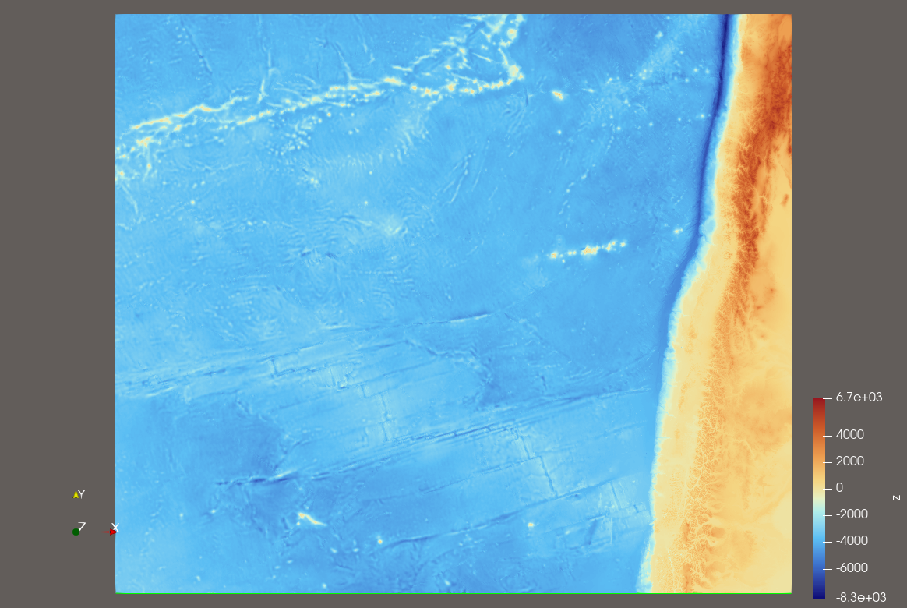
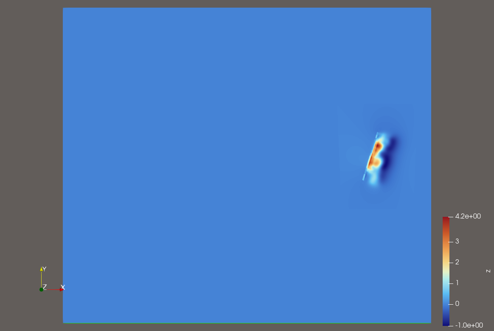
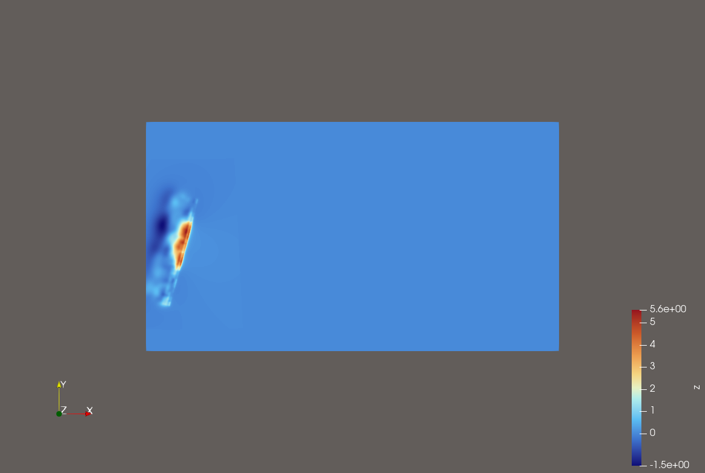

#################################
Submission 6: Tsunami Simulations
#################################

6.1. 2010 M 8.8 Chile Event
===========================

In dieser Aufgabe beschäftigen wir uns mit dem Chile Erdbeben und dadurch ausgelösten Tsunami-Event.
Dazu werden die vorgegebenen Daten eingelesen und für die Simulation verwendet.

**Die Visualisierung der Input-Daten:**

Für unser Setup verwenden wir ``setups::tsunamievent2d`` und haben drei verschiedene Grid Resolutionen simuliert.
Alle drei verwenden eine ähnliche Simulationskonfiguration.

Simulationskonfiguration
~~~~~~~~~~~~~~~~~~~~~~~~

Die Simulation wird mithilfe von ``configs/config.json`` konfiguriert. 
Wir untersuchen im Chile-Event die Resolutionen von 1000m, 2500m und 5000m. 

.. code-block:: json

    {
      "numerical_solver": "fwave",
      "scenario": "tsunamievent2d",
      "wave_model": "2d",
      "domain_size_x": 3500000,
      "domain_size_y": 2950000,
      "cells_x": 3500,
      "cells_y": 2950,
      "origin_x": -3000000,
      "origin_y": -1500000,
      "simulation_end_time": 36000,
      "output_format": "csv",
      "output_name": "chile_simu_1000_closed_boundary.csv",
      "reflective_boundary": true
    }

Damit ergibt sich eine Zellweite von :math:`dx = 3500000 m / 3500 = 1000 m`. 
Das heißt, dass wir hier :math:`3500*2950` Zellen untersuchen. 

Für die 2500m und 5000m wurde jeweils die Zellenweite angepasst. 
Folgende Tabelle beschreibt die benötigten Berechnungsdaten, also Zellenanzahl, Anzahl an Zellenupdates etc.

.. list-table::
   :header-rows: 1

   * - Zellweite
     - ``nx``
     - ``ny``
     - Zellen
     - Zellupdates fuer 1 Stunde bei ca. 20515 Schritten
   * - 1000 m
     - 3500
     - 2950
     - 10.325.000
     - ca. 211.8 Milliarden
   * - 2500 m
     - 1400
     - 1180
     - 1.652.000
     - ca. 33.9 Milliarden
   * - 5000 m
     - 700
     - 590
     - 413.000
     - ca. 8.5 Milliarden

An diesen Werten erkennt man auch: je kleiner die Resolution, desto genauer ist die Simulation, da mehr Zellen untersucht werden. 
Jedoch erfordert das extrem viele Zellupdates und somit auch Berechnungszeit. 

Hier beim Chile-Event haben wir aber die Simulationen mit reflektierenden Grenzen durchgeführt. (Bei Tohoku haben wir darauf verzichtet.) 
Demnach beobachten wir eher wann die erste Welle an den Grenzen reflektiert wird, anstatt wann die Welle die Grenzen verlässt.

Visualisierung
~~~~~~~~~~~~~~

Zuerst zeigen wir die Simulation mit der Resolution von 1000m.
//simulation 1000-m-Variante

Die zweite Simulation hat eine Resolution von 2500m.

.. raw:: html

   <video src="../_static/chile_2500.mp4" controls style="width: 72%; max-width: 760px; display: block; margin: 1rem auto;"></video>

Die dritte Simulation geht in 5000m Schritten voran.

.. raw:: html

   <video src="../_static/chile_5000.mp4" controls style="width: 72%; max-width: 760px; display: block; margin: 1rem auto;"></video>

Wann verlassen erste Wellen die Domain?
~~~~~~~~~~~~~~~~~~~~~~~~~~~~~~~~~~~~~~~

Das Domain geht von ``-3000 km`` bis ``500 km`` in x-Richtung und von ``-1500km`` bis ``1500km`` in y-Richtung. 
Das Epizentrum liegt bei 

6.2. 2011 M 9.1 Tohoku Event
============================

In dieser Aufgabe wird nur das Tohoku-Ereignis vom 11. Maerz 2011 betrachtet.
Die Simulation nutzt die vorhandenen NetCDF-Eingabedaten fuer Bathymetrie und
Displacement sowie das Setup ``tsunamievent2d``. Als Ausgabe verwenden wir
zunaechst CSV-Dateien, damit die Resultate einfach in ParaView kontrolliert
werden koennen.

Simulationskonfiguration
~~~~~~~~~~~~~~~~~~~~~~~~

Die aktuelle Konfiguration liegt in ``configs/config.json``. Die wichtigsten
Werte sind:

.. code-block:: json

    {
      "numerical_solver": "fwave",
      "scenario": "tsunamievent2d",
      "wave_model": "2d",
      "domain_size_x": 2700000,
      "domain_size_y": 1500000,
      "cells_x": 2700,
      "cells_y": 1500,
      "origin_x": -200000,
      "origin_y": -750000,
      "simulation_end_time": 36000,
      "output_format": "csv",
      "output_name": "tohoku_soma_1km_open_boundary.csv",
      "reflective_boundary": false
    }

Damit ergibt sich eine Zellweite von

``dx = 2700000 m / 2700 = 1000 m``.

Die Randbedingung ist ``reflective_boundary = false``. Damit werden offene
Raender bzw. Outflow-Bedingungen genutzt, was fuer diese Aufgabe sinnvoll ist:
die Welle soll die Computational Domain verlassen koennen und nicht kuenstlich
zurueck reflektiert werden.

Visualisierung
~~~~~~~~~~~~~~

Die Simulation schreibt alle 25 Zeitschritte CSV-Ausgaben nach ``outputs``.
Diese Dateien koennen in ParaView geladen werden. Fuer die Darstellung eignen
sich insbesondere:

* ``height`` fuer die freie Oberflaeche bzw. Wasserhoehe,
* ``momentum_x`` und ``momentum_y`` fuer die Bewegungsrichtung,
* ``bathymetry`` fuer das Meeresbodenprofil.

Fuer eine Animation werden die CSV-Dateien als zeitliche Serie geladen und mit
einer Hoehen- oder Diverging-Color-Map visualisiert.

**Tohoku Input-Daten**

.. figure:: ../_static/tohoku_20_250m_bathymetry.0000.png
    :width: 70%
    :align: center
    :alt: Die Bathymetrie Daten vom Tohoku Event

**Tohoku: 1000m Resolution**

.. raw:: html

   <video src="../_static/tohoku_1000.mp4" controls style="width: 72%; max-width: 760px; display: block; margin: 1rem auto;"></video>

**Tohoku: 2500m Resolution**

.. raw:: html

   <video src="../_static/tohoku_2500.mp4" controls style="width: 72%; max-width: 760px; display: block; margin: 1rem auto;"></video>

**Tohoku: 3500m Resolution**

.. raw:: html

   <video src="../_static/tohoku_3500.mp4" controls style="width: 72%; max-width: 760px; display: block; margin: 1rem auto;"></video>

Wann verlassen erste Wellen die Domain?
~~~~~~~~~~~~~~~~~~~~~~~~~~~~~~~~~~~~~~~

Die Domain reicht in x-Richtung von ``-200 km`` bis ``2500 km`` und in
y-Richtung von ``-750 km`` bis ``750 km``. Da die Projektion am Epizentrum
zentriert ist, liegt der kuerzeste Rand in westlicher Richtung nur etwa
``200 km`` entfernt. Die noerdlichen und suedlichen Raender liegen jeweils etwa
``750 km`` entfernt.

Mit der Flachwassergeschaetzung

``lambda = sqrt(g * h)``

und einer typischen Tiefsee-Tiefe von ``h = 4000 m`` ergibt sich

``lambda = sqrt(9.81 * 4000) = 198 m/s``.

Damit ergeben sich grob:

* westlicher Rand, ``200 km``: ca. ``200000 / 198 = 1010 s`` = **17 Minuten**
* noerdlicher/suedlicher Rand, ``750 km``: ca. ``750000 / 198 = 3785 s`` = **63 Minuten**
* weit entfernter oestlicher Rand, bis ca. ``2500 km``: ca. **3.5 Stunden**

Die erste Welle kann die Domain also schon nach ungefaehr **17 Minuten**
Simulationszeit an der kuerzesten Seite verlassen. Fuer die weit entfernten
offenen Raender muss man eher im Bereich von **1 bis 3.5 Stunden** simulieren.

Rechenaufwand
~~~~~~~~~~~~~

Fuer verschiedene Aufloesungen ergibt sich folgender Zellaufwand:

.. list-table::
   :header-rows: 1

   * - Zellweite
     - ``nx``
     - ``ny``
     - Zellen
     - Zellupdates fuer 1 Stunde bei ca. 4500 Schritten
   * - 1000 m
     - 2700
     - 1500
     - 4,050,000
     - ca. 18.2 Milliarden
   * - 500 m
     - 5400
     - 3000
     - 16,200,000
     - ca. 72.9 Milliarden
   * - 250 m
     - 10800
     - 6000
     - 64,800,000
     - ca. 291.6 Milliarden

Die 1000-m-Variante ist deshalb fuer Tests und erste Visualisierungen deutlich
praktischer. Die 250-m-Variante ist naeher an den Eingangsdaten, aber
entsprechend teuer.

6.2.2. Zeit zwischen Erdbebenbruch und Ankunft der ersten Tsunamiwellen in Soma
~~~~~~~~~~~~~~~~~~~~~~~~~~~~~~~~~~~~~~~~~~~~~~~~~~~~~~~~~~~~~~~~~~~~~~~~~~~~~~~

Gemessene Daten fuer Soma
^^^^^^^^^^^^^^^^^^^^^^^^^

Fuer die gemessenen Daten von Soma waehrend des Tohoku-Tsunamis vom
11. Maerz 2011 haben wir die Daten des National Centers for Environmental
Information (NCEI) verwendet. Die relevanten Werte fuer Soma sind:

.. list-table::
   :header-rows: 1

   * - Groesse
     - Wert
   * - Breitengrad
     - ``37.83300``
   * - Laengengrad
     - ``140.96700``
   * - Entfernung von der Quelle
     - ``134 km``
   * - Laufzeit
     - ``9 min``
   * - Maximale Wasserhoehe
     - ``9.3 m``

Quelle:

* NOAA/NCEI: ``Great Tohoku, Japan Earthquake and Tsunami, 11 March 2011``
  https://www.ngdc.noaa.gov/hazard/11mar2011.html

Abschaetzung der Laufzeit nach Soma
^^^^^^^^^^^^^^^^^^^^^^^^^^^^^^^^^^^

In der Aufgabe soll die Wellengeschwindigkeit mit folgender Naeherung
abgeschaetzt werden:

``lambda = sqrt(g * h)``.

Dafuer verwenden wir den Bathymetrie-Schnitt zwischen Soma und dem Epizentrum.
Die Datei enthaelt ``Points:0`` und ``Points:1`` als projizierte Koordinaten
und ``z`` als Bathymetriewert. Wir haben die Daten auf den Wasserbereich
zwischen Soma und dem Epizentrum zugeschnitten. Der erste verwendete Punkt ist

``-3.9362, -1.2386e+05, -53000, 0``

weil dies der erste Punkt nahe Soma mit negativer Bathymetrie ist. Damit liegt
dieser Punkt im Wasser. Den vorherigen Punkt

``5.7205, -1.25e+05, -53487, 0``

haben wir nicht verwendet, weil der positive Bathymetriewert auf Land
hindeutet. Das Zuschneiden endet bei

``-968.75, -1000, -427.9, 0``

damit der folgende Punkt

``-994.25, 1000, 427.9, 0``,

nicht mehr eingeschlossen wird. Dieser liegt bereits hinter dem Epizentrum.
Der Mittelwert der zugeschnittenen negativen Bathymetriewerte ergibt

``h = 255.6141787 m``.

Mit dieser effektiven Wassertiefe ergibt sich die Wellengeschwindigkeit zu

``lambda = sqrt(9.81 * 255.6141787) = 50.08 m/s``.

Soma liegt laut Aufgabenstellung etwa ``55 km`` suedlich und ``128 km``
westlich des Epizentrums. Die direkte Distanz ist daher

``distance = sqrt(55000^2 + 128000^2) = 139316 m``.

Die abgeschaetzte Laufzeit betraegt damit

``time = 139316 / 50.08 = 2782 s = 46.2 min``.

Dies ist nur eine grobe Naeherung, weil die komplette Bathymetrie und die reale
zweidimensionale Ausbreitung auf eine mittlere Wassertiefe reduziert werden.

Station nahe Soma
^^^^^^^^^^^^^^^^^

Fuer die Stationsmessung speichern wir alle ``20 s`` einen Messwert. Wir haben
den Punkt

``P[-123860 / -53000]``

ausgewaehlt, weil er der erste Punkt nahe Soma mit negativer Bathymetrie ist.
Er liegt also nicht auf Land und kann fuer die Messung von ``h``, ``hu`` und
``hv`` verwendet werden. Die Stationskonfiguration lautet:

.. code-block:: json

    {
      "frequency": 20,
      "stations": [
        {
          "i_name": "SomaNearshore",
          "i_x": -123860,
          "i_y": -53000
        }
      ]
    }

Die Simulation wurde mit dem Tohoku-Setup und einer Zellweite von ``1000 m``
durchgefuehrt. In der Stationsausgabe erreicht die erste klar erkennbare Welle
die Station nach ungefaehr

``2540 s = 42.33 min``.

Verglichen mit der Abschaetzung ergibt sich

``46.2 min - 42.33 min = 3.87 min``.

Die simulierte erste Ankunft liegt also etwa **3.87 Minuten frueher** als die
einfache bathymetriebasierte Abschaetzung. Diese Abweichung ist plausibel, da
die Rechnung mehrere Vereinfachungen verwendet: gemittelte Bathymetrie,
vereinfachte Distanz, grobe Gitterposition und eine eindimensionale
Wellengeschwindigkeit.

Vergleich der maximalen Wellenhoehe
^^^^^^^^^^^^^^^^^^^^^^^^^^^^^^^^^^^

Um die simulierten Stationsdaten mit dem gemessenen NCEI-Wert zu vergleichen,
vergleichen wir den maximalen ankommenden Wasserstand mit dem Anfangswasserstand
an der Station. In der Stationsausgabe betraegt die Anfangshoehe

``21.6348 m``,

und die hoechste gemessene Hoehe in der Simulation ist

``29.4237 m``.

Damit ergibt sich fuer die simulierte ankommende Wellenhoehe

``29.4237 m - 21.6348 m = 7.7889 m``.

Die gemessene maximale Wasserhoehe betraegt ``9.3 m``. Die Differenz ist daher

``9.3 m - 7.7889 m = 1.5111 m``.

Die simulierte maximale Wellenhoehe ist also etwa **1.51 m niedriger** als der
gemessene NCEI-Wert. Mit Blick auf das grobe ``1000 m``-Gitter und die
vereinfachte Stationsposition ist das fuer diese Simulation trotzdem ein
plausibles Ergebnis.
