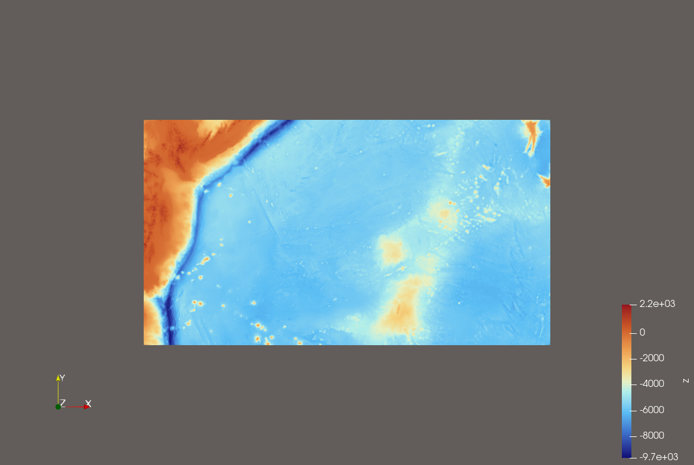

#################################
Submission 6: Tsunami Simulations
#################################

6.1. 2010 M 8.8 Chile Event
===========================

In dieser Aufgabe beschäftigen wir uns mit dem Chile Erdbeben und dadurch ausgelösten Tsunami-Event.
Dazu werden die vorgegebenen Daten eingelesen und für die Simulation verwendet.

**Die Visualisierung der Input-Daten:**

.. figure:: ../_static/chile_250m_bathymetry.png
  :width: 70%
  :align: center
  
  Die Bathymetrie Daten vom Chile Event

.. figure:: ../_static/chile_250m_displacement.png
  :width: 70%
  :align: center
  
  Die Displacement Daten vom Chile Event

Für unser Setup verwenden wir ``setups::tsunamievent2d`` und haben drei verschiedene Grid Resolutionen simuliert.
Alle drei verwenden eine ähnliche Simulationskonfiguration.

Simulationskonfiguration
~~~~~~~~~~~~~~~~~~~~~~~~

Die Simulation wird mithilfe von ``configs/config.json`` konfiguriert. 
Wir untersuchen im Chile-Event die Resolutionen von 1000m, 2500m und 5000m. 
Beim ausführen ist es wichtig die Input-Daten in ``data/nc/data_in/output`` gespeichert zu haben.

.. code-block:: json

    {
      "numerical_solver": "fwave",
      "scenario": "tsunamievent2d",
      "wave_model": "2d",
      "domain_size_x": 3500000,
      "domain_size_y": 2950000,
      "cells_x": 3500,
      "cells_y": 2950,
      "origin_x": -3000000,
      "origin_y": -1500000,
      "simulation_end_time": 36000,
      "output_format": "csv",
      "output_name": "chile_simu_1000_closed_boundary.csv",
      "reflective_boundary": true
    }

Damit ergibt sich eine Zellweite von :math:`dx = 3500000 m / 3500 = 1000 m`. 
Das heißt, dass wir hier :math:`3500*2950` Zellen untersuchen. 

Für die 2500m und 5000m wurde jeweils die Zellenweite angepasst. 
Folgende Tabelle beschreibt die benötigten Berechnungsdaten, also Zellenanzahl, Anzahl an Zellenupdates etc.

.. list-table::
   :header-rows: 1

   * - Zellweite
     - ``nx``
     - ``ny``
     - Zellen
     - Zellupdates fuer 1 Stunde bei ca. 20515 Schritten
   * - 1000 m
     - 3500
     - 2950
     - 10.325.000
     - ca. 211.8 Milliarden
   * - 2500 m
     - 1400
     - 1180
     - 1.652.000
     - ca. 33.9 Milliarden
   * - 5000 m
     - 700
     - 590
     - 413.000
     - ca. 8.5 Milliarden

An diesen Werten erkennt man auch: je kleiner die Resolution, desto genauer ist die Simulation, da mehr Zellen untersucht werden. 
Jedoch erfordert das extrem viele Zellupdates und somit auch Berechnungszeit. 

Hier beim Chile-Event haben wir aber die Simulationen mit reflektierenden Grenzen durchgeführt. (Bei Tohoku haben wir darauf verzichtet.) 
Demnach beobachten wir eher wann die erste Welle an den Grenzen reflektiert wird, anstatt wann die Welle die Grenzen verlässt.

Visualisierung
~~~~~~~~~~~~~~

Zuerst zeigen wir die Simulation mit der Resolution von 1000m.

.. raw:: html

   <video src="../_static/chile_1000.mp4" controls style="width: 72%; max-width: 760px; display: block; margin: 1rem auto;"></video>

Die zweite Simulation hat eine Resolution von 2500m.

.. raw:: html

   <video src="../_static/chile_2500.mp4" controls style="width: 72%; max-width: 760px; display: block; margin: 1rem auto;"></video>

Die dritte Simulation geht in 5000m Schritten voran.

.. raw:: html

   <video src="../_static/chile_5000.mp4" controls style="width: 72%; max-width: 760px; display: block; margin: 1rem auto;"></video>

Der Unterschied bei der Wellengeschwindigkeit kommt durch den Export der Animationen und unterschiedlichen Einstellungen diesbezüglich hervor. 

Wann verlassen die ersten Wellen die Domain?
~~~~~~~~~~~~~~~~~~~~~~~~~~~~~~~~~~~~~~~~~~~~

Das Domain geht von ``-3000 km`` bis ``500 km`` in x-Richtung und von ``-1500km`` bis ``1500km`` in y-Richtung. 
Das Epizentrum liegt in der Mitte unseres Domain, was bedeutet die Welle braucht etwa ``500 km`` bis zum ersten Domain-Rand. 
Dieser Rand ist der ostliche Rand. Der westliche Rand ist hingegen ``3000 km`` vom Epizentrum entfernt. 
Die Welle hat in Nord- und Südrichtung jeweils ``1500km`` bis zum Domain-Rand.

Mithilfe der Flachwassser-Gleichungen berechnen wir eine Approximation wann die ersten Wellen die Domain-Ränder verlassen. 

Dafür rechnen wir zu erst :math:`lambda = sqrt(g * h)` mit einer durchschnittlichen Tiefsee-Tiefe von :math:`h = 3500m`. 
Damit ergibt sich :math:`lambda = sqrt(9.81 * 3500) = 185 m/s`.

So können wir grob approximieren:

* ostlicher Rand, ``500 km``: ca. :math:`500000 / 185 = 2703 s` = **45 Minuten**
* westlicher Rand, ``3000 km``: ca. :math:`3000000 / 185 = 16216 s` = **4 Stunden 30 Minuten**
* Nord- und Süd-Rand (jeweils gleich), ``1500 km``: ca. :math:`1500000 / 185 = 8108 s` = **2 Stunden 15 Minuten**

6.2. 2011 M 9.1 Tohoku Event
============================

In dieser Aufgabe wird nur das Tohoku-Ereignis vom 11. März 2011 betrachtet.
Die Simulation nutzt die vorhandenen NetCDF-Eingabedaten fuer Bathymetrie und
Displacement sowie das Setup ``tsunamievent2d``. Als Ausgabe verwenden wir
zunächst CSV-Dateien, damit die Resultate einfach in ParaView kontrolliert
werden können.

Simulationskonfiguration
~~~~~~~~~~~~~~~~~~~~~~~~

Die aktuelle Konfiguration liegt in ``configs/config.json``. Die wichtigsten
Werte sind:

.. code-block:: json

    {
      "numerical_solver": "fwave",
      "scenario": "tsunamievent2d",
      "wave_model": "2d",
      "domain_size_x": 2700000,
      "domain_size_y": 1500000,
      "cells_x": 2700,
      "cells_y": 1500,
      "origin_x": -200000,
      "origin_y": -750000,
      "simulation_end_time": 36000,
      "output_format": "csv",
      "output_name": "tohoku_soma_1km_open_boundary.csv",
      "reflective_boundary": false
    }

Damit ergibt sich eine Zellweite von

``dx = 2700000 m / 2700 = 1000 m``.

Die Randbedingung ist ``reflective_boundary = false``. Damit werden offene
Ränder bzw. Outflow-Bedingungen genutzt, was für diese Aufgabe sinnvoll ist:
die Welle soll die Computational Domain verlassen können und nicht künstlich
zurück reflektiert werden.

Visualisierung
~~~~~~~~~~~~~~

Die Simulation schreibt alle 25 Zeitschritte CSV-Ausgaben nach ``outputs``.
Diese Dateien können in ParaView geladen werden. Für die Darstellung eignen
sich insbesondere:

* ``height`` für die freie Oberfläche bzw. Wasserhöhe,
* ``momentum_x`` und ``momentum_y`` für die Bewegungsrichtung,
* ``bathymetry`` für das Meeresbodenprofil.

Fuer eine Animation werden die CSV-Dateien als zeitliche Serie geladen und mit
einer Hoehen- oder Diverging-Color-Map visualisiert.

**Tohoku Input-Daten**

    
    Die Bathymetrie Daten vom Tohoku Event

.. figure:: ../_static/tohoku_20_250m_displacement.png
    :width: 70%
    :align: center
    
    Die Displacement Daten vom Tohoku Event

**Tohoku: 1000m Resolution** Animation wird noch ergänzt (Paraview war abgestürtzt)

.. raw:: html

   <video src="../_static/tohoku_1000.mp4" controls style="width: 72%; max-width: 760px; display: block; margin: 1rem auto;"></video>

Ungefähre Ausführungszeit (1000m): 6 Stunden 40 Minuten 

**Tohoku: 2500m Resolution**

.. raw:: html

   <video src="../_static/tohoku_2500.mp4" controls style="width: 72%; max-width: 760px; display: block; margin: 1rem auto;"></video>

Ungefähre Ausführungszeit (2500m): 2 Stunden 40 Minuten

**Tohoku: 3500m Resolution**

.. raw:: html

   <video src="../_static/tohoku_3500.mp4" controls style="width: 72%; max-width: 760px; display: block; margin: 1rem auto;"></video>

Ungefähre Ausführungszeit (3500m): 1 Stunde 55 Minuten

Wann verlassen erste Wellen die Domain?
~~~~~~~~~~~~~~~~~~~~~~~~~~~~~~~~~~~~~~~

Die Domain reicht in x-Richtung von ``-200 km`` bis ``2500 km`` und in
y-Richtung von ``-750 km`` bis ``750 km``. Da die Projektion am Epizentrum
zentriert ist, liegt der kürzeste Rand in westlicher Richtung nur etwa
``200 km`` entfernt. Die nördlichen und südlichen Ränder liegen jeweils etwa
``750 km`` entfernt.

Mit der Flachwassergeschaetzung

``lambda = sqrt(g * h)``

und einer typischen Tiefsee-Tiefe von ``h = 4000 m`` ergibt sich

``lambda = sqrt(9.81 * 4000) = 198 m/s``.

Damit ergeben sich grob:

* westlicher Rand, ``200 km``: ca. ``200000 / 198 = 1010 s`` = **17 Minuten**
* nördlicher/südlicher Rand, ``750 km``: ca. ``750000 / 198 = 3785 s`` = **63 Minuten**
* weit entfernter östlicher Rand, bis ca. ``2500 km``: ca. **3.5 Stunden**

Die erste Welle kann die Domain also schon nach ungefähr **17 Minuten**
Simulationszeit an der kürzesten Seite verlassen. Für die weit entfernten
offenen Ränder muss man eher im Bereich von **1 bis 3.5 Stunden** simulieren.

Rechenaufwand
~~~~~~~~~~~~~

Für verschiedene Auflösungen ergibt sich folgender Zellaufwand:

.. list-table::
   :header-rows: 1

   * - Zellweite
     - ``nx``
     - ``ny``
     - Zellen
     - Zellupdates für 1 Stunde bei ca. 4500 Schritten
   * - 1000 m
     - 2700
     - 1500
     - 4,050,000
     - ca. 18.2 Milliarden
   * - 500 m
     - 5400
     - 3000
     - 16,200,000
     - ca. 72.9 Milliarden
   * - 250 m
     - 10800
     - 6000
     - 64,800,000
     - ca. 291.6 Milliarden

Die 1000-m-Variante ist deshalb für Tests und erste Visualisierungen deutlich
praktischer. Die 250-m-Variante ist näher an den Eingangsdaten, aber
entsprechend teuer.

**Gemessene Laufzeiten**

Im Folgenden sind die tatsächlichen Ausführungszeiten für unsere Durchläufe mit unterschiedlichen Auflösungen aufgelistet. Der enorme Anstieg der Rechenzeit bei feinerem Gitter ist hier deutlich zu erkennen:

* **Tohoku 3500m:** Duration:  1 minutes, 9 seconds, 854 milliseconds, 491 microseconds, 399 nanoseconds
* **Tohoku 2500m:** Duration:  3 minutes, 17 seconds, 856 milliseconds, 741 microseconds, 700 nanoseconds
* **Tohoku 1000m:** Duration:  58 minutes, 11 seconds, 613 milliseconds, 132 microseconds, 200 nanoseconds

6.2.2. Zeit zwischen Erdbebenbruch und Ankunft der ersten Tsunamiwellen in Soma
~~~~~~~~~~~~~~~~~~~~~~~~~~~~~~~~~~~~~~~~~~~~~~~~~~~~~~~~~~~~~~~~~~~~~~~~~~~~~~~

Gemessene Daten für Soma
^^^^^^^^^^^^^^^^^^^^^^^^^

Für die gemessenen Daten von Soma während des Tohoku-Tsunamis vom
11. März 2011 haben wir die Daten des National Centers for Environmental
Information (NCEI) verwendet. Die relevanten Werte für Soma sind:

.. list-table::
   :header-rows: 1

   * - Groesse
     - Wert
   * - Breitengrad
     - ``37.83300``
   * - Laengengrad
     - ``140.96700``
   * - Entfernung von der Quelle
     - ``134 km``
   * - Laufzeit
     - ``9 min``
   * - Maximale Wasserhoehe
     - ``9.3 m``

Quelle:

* NOAA/NCEI: ``Great Tohoku, Japan Earthquake and Tsunami, 11 March 2011``
  https://www.ngdc.noaa.gov/hazard/11mar2011.html

Abschätzung der Laufzeit nach Soma
^^^^^^^^^^^^^^^^^^^^^^^^^^^^^^^^^^^

In der Aufgabe soll die Wellengeschwindigkeit mit folgender Näherung
abgeschätzt werden:

``lambda = sqrt(g * h)``.

Dafür verwenden wir den Bathymetrie-Schnitt zwischen Soma und dem Epizentrum.
Die Datei enthält ``Points:0`` und ``Points:1`` als projizierte Koordinaten
und ``z`` als Bathymetriewert. Wir haben die Daten auf den Wasserbereich
zwischen Soma und dem Epizentrum zugeschnitten. Der erste verwendete Punkt ist

``-3.9362, -1.2386e+05, -53000, 0``

weil dies der erste Punkt nahe Soma mit negativer Bathymetrie ist. Damit liegt
dieser Punkt im Wasser. Den vorherigen Punkt

``5.7205, -1.25e+05, -53487, 0``

haben wir nicht verwendet, weil der positive Bathymetriewert auf Land
hindeutet. Das Zuschneiden endet bei

``-968.75, -1000, -427.9, 0``

damit der folgende Punkt

``-994.25, 1000, 427.9, 0``,

nicht mehr eingeschlossen wird. Dieser liegt bereits hinter dem Epizentrum.
Der Mittelwert der zugeschnittenen negativen Bathymetriewerte ergibt

``h = 255.6141787 m``.

Mit dieser effektiven Wassertiefe ergibt sich die Wellengeschwindigkeit zu

``lambda = sqrt(9.81 * 255.6141787) = 50.08 m/s``.

Soma liegt laut Aufgabenstellung etwa ``55 km`` südlich und ``128 km``
westlich des Epizentrums. Die direkte Distanz ist daher

``distance = sqrt(55000^2 + 128000^2) = 139316 m``.

Die abgeschätzte Laufzeit beträgt damit

``time = 139316 / 50.08 = 2782 s = 46.2 min``.

Dies ist nur eine grobe Näherung, weil die komplette Bathymetrie und die reale
zweidimensionale Ausbreitung auf eine mittlere Wassertiefe reduziert werden.

Station nahe Soma
^^^^^^^^^^^^^^^^^

Für die Stationsmessung speichern wir alle ``20 s`` einen Messwert. Wir haben
den Punkt

``P[-123860 / -53000]``

ausgewählt, weil er der erste Punkt nahe Soma mit negativer Bathymetrie ist.
Er liegt also nicht auf Land und kann für die Messung von ``h``, ``hu`` und
``hv`` verwendet werden. Die Stationskonfiguration lautet:

.. code-block:: json

    {
    "frequency": 20,
    "stations": 
    [
        {
            "i_name": "SomaStation",
            "i_x": -12000,
            "i_y": -50000
        }
    ]

}

Die Simulation wurde mit dem Tohoku-Setup und einer Zellweite von ``1000 m``
durchgeführt. In der Stationsausgabe erreicht die erste klar erkennbare Welle
die Station nach ungefähr

``2540 s = 42.33 min``.

Verglichen mit der Abschätzung ergibt sich

``46.2 min - 42.33 min = 3.87 min``.

Die simulierte erste Ankunft liegt also etwa **3.87 Minuten frueher** als die
einfache bathymetriebasierte Abschätzung. Diese Abweichung ist plausibel, da
die Rechnung mehrere Vereinfachungen verwendet: gemittelte Bathymetrie,
vereinfachte Distanz, grobe Gitterposition und eine eindimensionale
Wellengeschwindigkeit.

Vergleich der maximalen Wellenhöhe
^^^^^^^^^^^^^^^^^^^^^^^^^^^^^^^^^^^

Um die simulierten Stationsdaten mit dem gemessenen NCEI-Wert zu vergleichen,
vergleichen wir den maximalen ankommenden Wasserstand mit dem Anfangswasserstand
an der Station. In der Stationsausgabe beträgt die Anfangshöhe

``21.6348 m``,

und die höchste gemessene Höhe in der Simulation ist

``29.4237 m``.

Damit ergibt sich für die simulierte ankommende Wellenhöhe

``29.4237 m - 21.6348 m = 7.7889 m``.

Die gemessene maximale Wasserhöhe beträgt ``9.3 m``. Die Differenz ist daher

``9.3 m - 7.7889 m = 1.5111 m``.

Die simulierte maximale Wellenhöhe ist also etwa **1.51 m niedriger** als der
gemessene NCEI-Wert. Mit Blick auf das grobe ``1000 m``-Gitter und die
vereinfachte Stationsposition ist das für diese Simulation trotzdem ein
plausibles Ergebnis.
