#########################
Submission 8: Optimierung
#########################

Diese Woche familisieren wir uns mit den Draco Cluster. 
Wir vergleichen unsere Simulation und ihre Performance unter verschieden Umständen und mit Nutzung verschiedener Compiler.
Dazu sollen wir untersuchen, wo in unserem Code Bottlenecks und Hotspots sind, die wir optimieren können.

8.1 Draco
=========

1. Timer für Zeitschritt-Schleife
---------------------------------

Wir dachten, am besten wäre es denn Timer am Anfang zu implementieren um bei den verschiedenen Simulationen direkt schon die Zeit dabei zu haben. 
So müssen wir nicht dieselben Simulationen mehrfach auf dem eigenen Computer oder auf dem Cluster durchführen. 

Mithilfe der ``std::chrono::high_resolution_clock::now()`` berechnen wir die Zeit, wie lange die Zeitschritt-Schleife dauerte und wie lange 
die gesamte Berechnung inklusive Initialisierung der Zellen dauert. 
Die Zeit messen wir in Nanosekunden, um so genau wie möglich zu messen.

Desweiteren haben wir eine Funktion ``printDuration(std::chrono::nanoseconds duration)`` eingeführt, die uns die Zeitlänge auch in Stunden, Minuten etc. ausgibt und nicht nur in Nanosekunden.

Die Setup-Zeit war zwar nicht in der Aufgabe gefragt gewesen, aber wir hatten persönliches Interesse an wie lange diese dauern kann.

Dadurch, dass wir die Zeit vor den ersten Kompilierungen auf den Clustern implementiert haben, befindet sich der zeitliche Vergleich 
sowie die interaktiven und batch Jobs im nächsten Abschnitt.

2. Interaktive und batch Jobs
-----------------------------

Für die interaktiven und batch Jobs wurden die Simulationen von dem ``tsunami_lab`` Ordner ausgeführt. 
Demnach ist auch das batch-Skript entstanden. 
Um das Ausführen der Simulation mit dem batch-Skript zu vereinfachen, haben wir eine boolean Variable eingeführt, um 
die Launch-Settings Eingabe zu überspringen. 
Wir ändern die Konfiguration für die batch-Jobs nicht. 

Wir haben verschiedene Szenarien ausprobiert, um zu testen, dass wir die gleichen Resultate auf dem Cluster bekommen, wie bei vorherigen Simulationen. 

Dafür überprüften wir zuerst Tohoku mit 3500m-Auflösung.
Diese ist eine sehr großschrittige Simulation und braucht nicht zuviel Zeit bei der Berechnung.

**Tohoku 3500m Auflösung**

Die ``config.json`` Datei, die für diese Simulation genutzt wurde (wie vorher sind die Input-Dateien im angezeigten Pfad gespeichert):

.. code-block:: json

    {
        "numerical_solver" : "fwave",
        "scenario" :  "tsunamievent2d",
        "wave_model" : "2d",
        "domain_size_x" : 2700000,
        "domain_size_y" : 1500000,
        "cells_x" : 771,
        "cells_y" : 429,
        "coarse_factor" : 4,
        "origin_x" : -200000,
        "origin_y" : -750000,
        "simulation_end_time" : 3600,
        "output_format" : "netcdf",
        "bathymetry_file" : "data/nc/data_in/output/tohoku_gebco20_ucsb3_250m_bath.nc",
        "displacement_file" : "data/nc/data_in/output/tohoku_gebco20_ucsb3_250m_displ.nc",
        "output_name": "tohoku_3500m_coarse_k4.nc",
        "reflective_boundary" : false,
        "initial_momentum_x" : 0,
        "initial_momentum_y": 0.0,
        "left_height": 25,
        "right_height": 55,
        "dam_location" : 0
    }

Für den batch-Job wurde folgendes batch-Skript verwendet:

.. code-block:: bash

    #!/bin/bash
    #SBATCH --job-name=tsunami
    #SBATCH --partition=short
    #SBATCH --ntasks=1
    #SBATCH --output=tsunami.out.%j
    #SBATCH --error=tsunami.err.%j
    #SBATCH --time=10:00
    #SBATCH --cpus-per-task=96
    echo "Job startet at: $(date)"
    scons
    ./build/tsunami_lab << EOF
    yes
    EOF
    echo "Job finished at: $(date)"

*Vergleichstabelle von persönlichen Computer, interaktiven und batch Jobs*

.. list-table::
    :header-rows: 1

    * - Information
      - Persönlicher Computer
      - Interaktiver Job
      - Batch Job
    * - cells
      - 771 x 429 = 330.759
      - 771 x 429 = 330.759
      - 771 x 429 = 330.759
    * - cell width
      - 3501.95 m
      - 3501.95 m
      - 3501.95 m
    * - time step
      - 5.72301 seconds
      - 5.72301 seconds
      - 5.72304 seconds
    * - steps
      - 630
      - 630
      - 630
    * - Duration of time step loop
      - 5 s, 726 ms, 966 µs, 700 ns
      - 22 s, 548 ms, 348 µs, 261 ns
      - 21 s, 717 ms, 561 µs, 433 ns
    * - Time per Cell (duration time step loop/cells)
      - 17 µs, 314 ns
      - 68 µs, 171 ns
      - 65 µs, 659 ns
    * - Time per Iteration (duration time step loop/steps)
      - 9 ms, 90 µs, 423 ns
      - 35 ms, 791 µs, 28 ns
      - 34 ms, 472 µs, 319 ns
    * - Duration of programm
      - 7 s, 300 ms, 386 µs, 0 ns
      - 28 s, 772 ms, 981 µs, 698 ns
      - 26 s, 621 ms, 999 µs, 269 ns
     
Die Time per Cell und Time per Iteration wurden mithilfe von Duration of time step loop, Steps und Cells berechnet. 
Dafür wurden einfach Steps bzw. Cells durch die Zeit geteilt.

Es war überraschend, dass auf meinem persönlichen Computer die Simulationen wesentlich schneller waren als auf dem Cluster. 
Dabei ist aber zu bedenken, dass wir noch keine Parallelisierung hinzugefügt hatten oder andere Optimierungen. 
Spannend ist auch, dass die Simulation über einen batch-Job schneller ging, als ein interaktiver Job. 
Dabei wird bei der Zeit nur die tatsächliche Berechnung der Simulation gemessen und nichts von der Konfiguration.

Hier nochmal die Visualisierung von der berechnenten Simulation:

.. raw:: html

   <video src="../_static/tohoku_3500_personalPC.mp4" controls style="width: 72%; max-width: 760px; display: block; margin: 1rem auto;"></video>

Visualisierung der Daten berechnet mit persönlichen Computer. 
Die Visualiserung der Daten, die das Cluster überliefert hat, war identisch, demnach entsprechen auch die Werte.

**Chile 2500m Auflösung**

Die ``config.json`` Datei, die für diese Simulation genutzt wurde (wie vorher sind die Input-Dateien im angezeigten Pfad gespeichert):

.. code-block:: json

    {
        "numerical_solver" : "fwave",
        "scenario" :  "tsunamievent2d",
        "wave_model" : "2d",
        "domain_size_x" : 3500000,
        "domain_size_y" : 2950000,
        "cells_x" : 1400,
        "cells_y" : 1180,
        "coarse_factor" : 1,
        "origin_x" : -3000000,
        "origin_y" : -1500000,
        "simulation_end_time" : 3600,
        "output_format" : "netcdf",
        "bathymetry_file" : "data/nc/data_in/output/chile_gebco20_usgs_250m_bath_fixed.nc",
        "displacement_file" : "data/nc/data_in/output/chile_gebco20_usgs_250m_displ_fixed.nc",
        "output_name": "chile_2500m_coarse_k1.nc",
        "reflective_boundary" : false,
        "initial_momentum_x" : 0,
        "initial_momentum_y": 0.0,
        "left_height": 25,
        "right_height": 55,
        "dam_location" : 0
    }

Das batch-Skript ist analog zur Tohoku Simulation.

*Vergleichstabelle von persönlichen Computer, interaktiven und batch Jobs*

.. list-table::
    :header-rows: 1

    * - Information
      - Persönlicher Computer
      - Interaktiver Job
      - Batch Job
    * - cells
      - 1400 x 1180 = 1.652.000
      - 1400 x 1180 = 1.652.000
      - 1400 x 1180 = 1.652.000
    * - cell width
      - 2500 m
      - 2500 m
      - 2500 m
    * - time step
      - 4.40831 seconds
      - 4.40831 seconds
      - 4.40831 seconds
    * - steps
      - 817
      - 817
      - 817
    * - Duration of time step loop
      - 0 min, 38 s, 144 ms, 639 µs, 300 ns
      - 2 min, 21 s, 69 ms, 896 µs, 165 ns
      - 1 min, 50 s, 624 ms, 224 µs, 284 ns
    * - Time per Cell (duration time step loop/cells)
      - 23 µs, 89 ns
      - 85 µs, 393 ns
      - 66 µs, 963 ns
    * - Time per Iteration (duration time step loop/steps)
      - 46 ms, 688 µs, 664 ns
      - 172 ms, 668 µs, 171 ns
      - 135 ms, 402 µs, 967 ns
    * - Duration of programm
      - 0 min, 49 s, 821 ms, 237 µs, 600 ns
      - 3 min, 5 s, 65 ms, 49 µs, 37 ns
      - 2 min, 29 s, 349 ms, 708 µs, 569 ns
     
Berechnungen von Time per Cell und Timer per Iteration analog zu Tohoku 3500m Simulation.

Auch hier war mein persönlicher Computer wesentlich schneller als das Cluster. Genauso war der batch-Job schneller als der interaktive. 

Hier nochmal die Visualisierung von der berechnenten Simulation:

.. raw:: html

   <video src="../_static/chile_2500_personalPC.mp4" controls style="width: 72%; max-width: 760px; display: block; margin: 1rem auto;"></video>

Auch hier war die Visualiserung der Dateien von den interaktiven und batch Jobs identisch zu der Ausgabe vom persönlichen PC.

**Erkenntnisse**

In diesem Fall war der persönliche Computer immer am schnellsten, danach kam der batch-Job und zuletzt der interaktive Job. 
Ob diese Zeiten bei weiter Optimierung und Parallelisierung bei behalten werden, bezweifle ich, aufgrund der Tatsache, 
dass die Cluster auf Parallelisierung ausgelegt sind oder zumindest größeren Berechnungen. 
Da eine große Auflösung untersucht wurde, wissen wir nicht wie sich die Rechner bei kleinerer Auflösung verhalten. 
Anhand den Unterschieden zwischen Tohoku und Chile lässt sich aber erschließen, dass die Cluster weiterhin deutlich länger gebraucht hätten 
als der persönliche Computer.

8.2 Compiler
============

1. Generische Compiler
----------------------

In diesem Teil vergleichen wir zwei verschiedene C++ Compiler: den GNU Compiler ``g++`` aus der GNU Compiler Collection und den LLVM/Clang Compiler ``clang++``.
Beide Compiler können C++ Code optimieren, aber sie treffen dabei teilweise unterschiedliche Entscheidungen. 
Deshalb kann derselbe Quellcode je nach Compiler unterschiedlich schnelle Programme erzeugen.
Die offiziellen Projektseiten sind:

* GNU Compiler Collection: https://gcc.gnu.org/
* Clang / LLVM: https://clang.llvm.org/

Damit wir unseren Code flexibel mit beiden Compilern übersetzen können, haben wir unser ``SConstruct`` erweitert.
Der Compiler kann nun über die Umgebungsvariable ``CXX`` ausgewählt werden. 
Dafür wird die Umgebung mit ``os.environ.copy()`` an die SCons-Umgebung weitergegeben.
Wenn ``CXX`` in der Umgebung gesetzt ist, wird der lokale SCons-Wert ``CXX`` entsprechend ersetzt:

.. code-block:: python

    env = Environment( variables = vars,
                       ENV = os.environ.copy() )

    if 'CXX' in os.environ:
      env.Replace( CXX = os.environ['CXX'] )

Damit kann ein Build mit GNU zum Beispiel so gestartet werden:

.. code-block:: bash

    CXX=g++ scons

Ein Build mit Clang funktioniert entsprechend mit:

.. code-block:: bash

    CXX=clang++ scons

Zusätzlich gibt das Build-Script den ausgewählten Compiler aus. 
Dadurch sieht man direkt beim Kompilieren, ob wirklich der gewünschte Compiler verwendet wurde.

2. GNU vs Clang
---------------

Für den Vergleich sollen beide Compiler auf dem Cluster mit derselben Simulationskonfiguration getestet werden.
Wichtig ist dabei, dass der Solver nicht auf den Login Nodes ausgeführt wird, sondern nur in einem interaktiven Job oder Batch Job auf einem Compute Node.
Damit die Laufzeiten vergleichbar bleiben, verwenden wir für alle Messungen dieselbe Konfiguration, zum Beispiel die Tohoku-Simulation mit 3500m-Auflösung aus Abschnitt 8.1.

Der Ablauf für GNU ist:

.. code-block:: bash

    scons -c
    CXX=g++ scons opt=O3
    srun ./build/tsunami_lab

Der Ablauf für Clang ist:

.. code-block:: bash

    scons -c
    CXX=clang++ scons opt=O3
    srun ./build/tsunami_lab

Gemessen wird vor allem die Dauer der Zeitschritt-Schleife, da diese den eigentlichen Rechenaufwand besser beschreibt als die gesamte Programmlaufzeit inklusive Setup und Ein-/Ausgabe.

.. list-table::
    :header-rows: 1

    * - Compiler
      - Optimierung
      - Duration of time step loop
      - Duration of program
      - Bemerkung
    * - ``g++``
      - ``-O3``
      - 13 s, 98 ms, 198 µs, 41 ns
      - 17 s, 206 ms, 81 µs, 994 ns
      - GNU Compiler
    * - ``clang++``
      - ``-O3``
      - 14 s, 941 ms, 354 µs, 490 ns
      - 18 s, 978 ms, 690 µs, 814 ns
      - LLVM/Clang Compiler

Aus diesen Messungen lässt sich anschließend ableiten, welcher Compiler für unsere konkrete Implementierung schnelleren Code erzeugt.
Da Compileroptimierungen stark vom Code, von der CPU und von den verwendeten Flags abhängen, erwarten wir nicht automatisch, dass ein Compiler immer schneller ist.

3. Optimierungs-Switches
------------------------

Um verschiedene Optimierungslevel einfacher testen zu können, wurde im ``SConstruct`` eine neue Option ``opt`` hinzugefügt.
Diese Option kann die Werte ``O0``, ``O1``, ``O2``, ``O3`` und ``Ofast`` annehmen.
Für Release-Builds wird daraus automatisch das passende Compiler-Flag erzeugt, zum Beispiel ``-O2`` oder ``-Ofast``.

Beispiele für die Messungen:

.. code-block:: bash

    scons -c
    CXX=g++ scons opt=O2
    srun ./build/tsunami_lab

    scons -c
    CXX=g++ scons opt=Ofast
    srun ./build/tsunami_lab

    scons -c
    CXX=clang++ scons opt=O2
    srun ./build/tsunami_lab

    scons -c
    CXX=clang++ scons opt=Ofast
    srun ./build/tsunami_lab

Die Messergebnisse (Zeitschritt-Schleife) können dann in folgender Tabelle verglichen werden:

.. list-table::
    :header-rows: 1

    * - Compiler
      - ``-O2``
      - ``-O3``
      - ``-Ofast``
    * - ``g++``
      - 14 s, 145 ms, 57 µs, 274 ns
      - 13 s, 98 ms, 198 µs, 41 ns
      - 12 s, 425 ms, 937 µs, 630 ns
    * - ``clang++``
      - 14 s, 292 ms, 153 µs, 827 ns
      - 14 s, 941 ms, 354 µs, 490 ns
      - 14 s, 459 ms, 469 µs, 168 ns

Bei numerischen Simulationen muss man bei Optimierungsflags vorsichtig sein.
Besonders ``-Ofast`` kann die Laufzeit verbessern, ist aber nicht immer unproblematisch.
Dieses Flag erlaubt dem Compiler aggressivere Optimierungen und kann unter anderem strenge Floating-Point-Regeln lockern.
Dadurch können Operationen umsortiert werden oder Annahmen ueber ``NaN``- und ``Inf``-Werte getroffen werden.
Für unsere Tsunami-Simulation bedeutet das: Auch wenn ``-Ofast`` schneller ist, müssen wir prüfen, ob die berechneten Wasserhöhen, Ankunftszeiten und Wellenausbreitungen weiterhin plausibel bleiben.
Deshalb vergleichen wir nicht nur die Laufzeit, sondern kontrollieren auch, ob die Simulationsergebnisse gegenüber ``-O2`` oder ``-O3`` sichtbar abweichen.

4. Optimierungsberichte
-----------------------

Compiler können Optimierungsberichte ausgeben.
Diese Berichte helfen zu verstehen, welche Schleifen optimiert oder vektorisiert wurden und welche Funktionen inline gesetzt wurden.
Für Clang haben wir im Build-Script die Option ``use_report`` ergänzt.
Wenn diese Option aktiviert ist und ``clang++`` verwendet wird, werden folgende Flags gesetzt:

.. code-block:: bash

    -Rpass=.*
    -Rpass-missed=.*
    -Rpass-analysis=.*

Der Build mit Clang-Report kann so gestartet werden:

.. code-block:: bash

    scons -c
    CXX=clang++ scons opt=O3 use_report=yes 2> clang_report.txt

Die Ausgabe wird in diesem Beispiel in ``clang_report.txt`` gespeichert.
Darin können wir nach den zeitintensiven Bereichen suchen, insbesondere nach ``WavePropagation2d::timeStep`` und ``fwave::netUpdates``.
Diese Teile sind für uns besonders interessant, weil die Zeitschritt-Schleife sehr oft ausgeführt wird und der f-wave Solver in jeder Zelle Updates berechnet.

Für GCC haben wir ebenfalls einfache Report-Flags ergänzt:

.. code-block:: bash

    -fopt-info-vec-optimized
    -fopt-info-vec-missed
    -fopt-info-inline-optimized
    -fopt-info-inline-missed

Damit kann auch für ``g++`` untersucht werden, ob Schleifen vektorisiert wurden und ob Funktionen inline gesetzt wurden.
Besonders wichtig sind dabei zwei Fragen:

* Kann der Compiler die grossen Schleifen in der Zeitschrittberechnung vektorisieren?
* Wird der f-wave Solver, insbesondere ``fwave::netUpdates``, in die Zeitschritt-Schleife hinein inlined?

Falls der Bericht zeigt, dass wichtige Schleifen nicht vektorisiert werden, können mögliche Ursachen Datenabhängigkeiten, Funktionsaufrufe innerhalb der Schleife oder unklare Speicherzugriffe sein.
Falls ``fwave::netUpdates`` nicht inlined wird, kann das ebenfalls Laufzeit kosten, weil diese Funktion sehr häufig aufgerufen wird.
Die Optimierungsberichte geben uns damit Hinweise, an welchen Stellen weitere Performance-Verbesserungen sinnvoll sein könnten.

8.3 Instrumentalisierung und Performance Zähler
===============================================

1. VTune
--------

Ich hatte am Anfang ein paar Probleme VTune zu starten und dann das Interface korrekt zu verstehen, aber am Ende hatte ich dann alles herausgefunden. 
Die Aufgabenstellung war, was die erste Analyse durchführen betrifft, bezüglich der Ausführung auf einem Knoten etwas unklar gewesen. 
Am Ende habe ich es interaktiv über die Command-Line gemacht, aber aufgrund der verschieden Optionen im VTune Menü war dies nicht direkt klar gewesen. 

Für unsere erste VTune Analyse haben wir eine Hotspots-Analyse durchgeführt. Dazu haben wir folgenden Command eingegeben:

.. code-block:: bash
  
  /cluster/intel/oneapi/2025.0.0/vtune/2025.0/bin64/vtune -collect hotspots --app-working-dir=/home/ne67fuh/tsunami_lab -- /home/ne67fuh/tsunami_lab/build/tsunami_lab

Der VTune Bericht wurde dann auch in unserem ``tsunami_lab`` Verzeichnis gespeichert. 
Folgende Bilder sind der Bericht mit dem VTune-Interface gelesen.

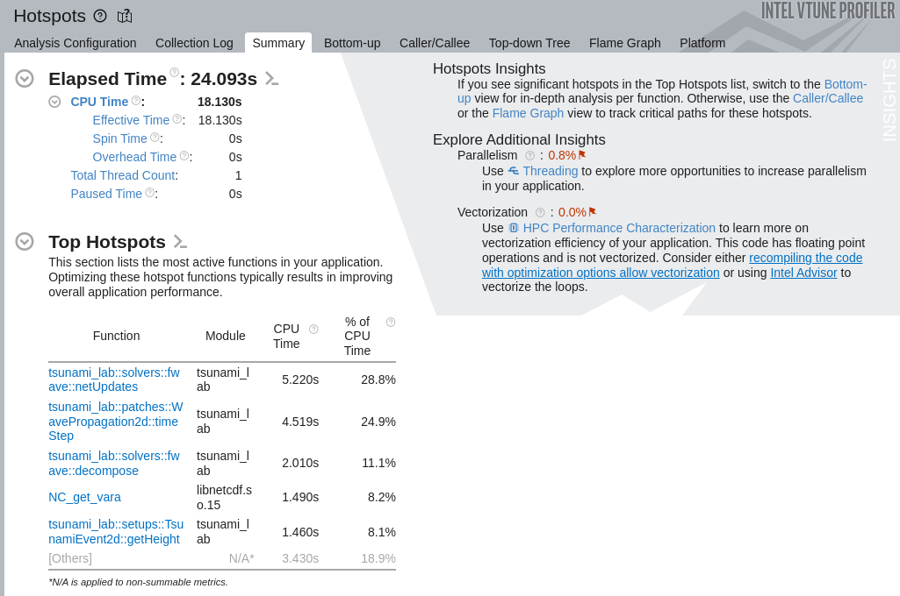
  
  Zusammenfassung: Zeit und Top Hotspots

Hier können wir herauslesen, wie lange das Programm dauerte und welche Funktionen, die top Hotspots sind. 

Für unser Programm werden hier ``solver::fwave::netUpdates``, ``WavePropagation2d::timeStep``, ``solver::fwave::decompose`` und die ``TsunamiEvent2d::get*`` Funktionen 
als die top Hotspots übergeben. 

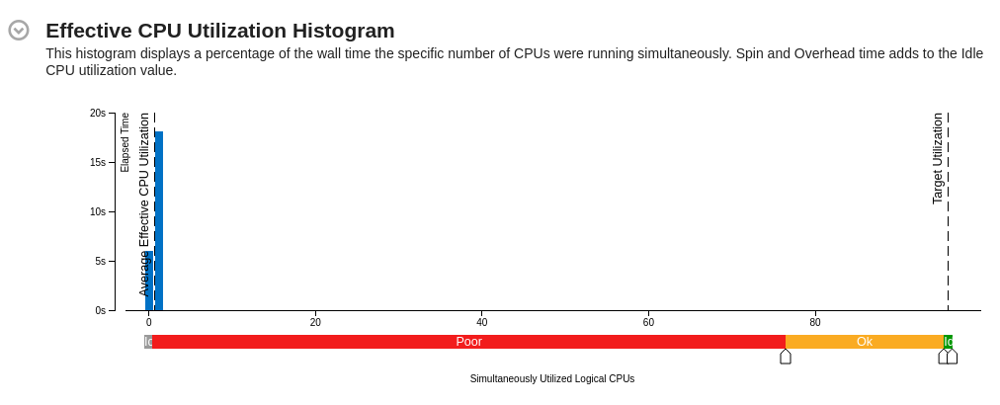
  
  Zusammenfassung: Histogramm von effektiver CPU Nutzung

Da wir bis jetzt noch keine Parallelisierung implementiert haben, ist es kein Wunder, dass die CPUs so genutzt wurden.

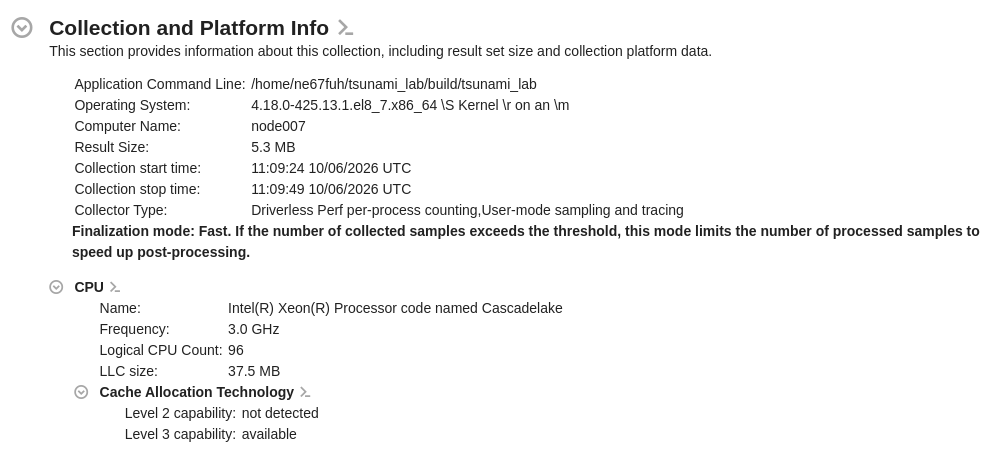
  
  Zusammenfassung: Information über Analyse und Platform

Hier stehen ledglich Informationen über wann, wo und worauf die Analyse durchgeführt wurde.

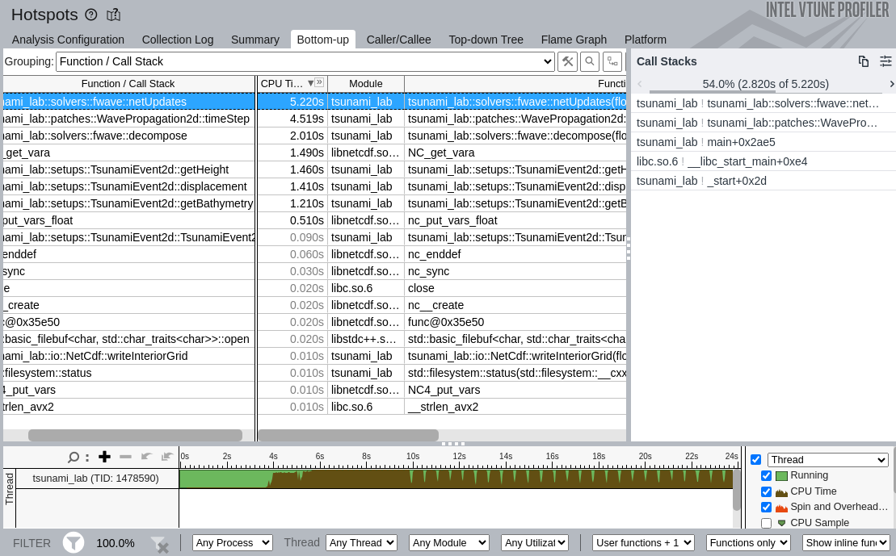
  
  Bottom-Up Graph von den Funktionen und deren CPU Laufzeit

Hier gibt es die Funktionen und Hotspots nocheinmal im Detail. 
Auch hier ist natürlich die ``fwave::netUpdates`` Funktion ganz oben. 
Einige Hotspots kommen aus unserem Programm, aber einige entstehen auch durch die NetCDF Datei Schreibung beziehungsweise Lesung. 

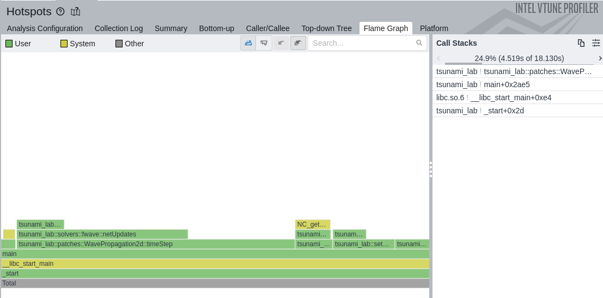
  
  Flame-Graph des Programms

Hier wird nochmal dargestellt, wie im Verlauf des Programms, die Hotspot-Funktionen genutzt werden und wo sie überlappen.

Dies war der erste Eindruck der VTune Analyse und die Informationen, die wir dadurch bekommen.

2. Analyse in batch-Job
-----------------------

Unser batch-Skript folgt für die Ausführung der Analyse:

.. code-block:: bash

    #!/bin/bash
    #SBATCH --job-name=tsunami_analysis
    #SBATCH --partition=short
    #SBATCH --ntasks=1
    #SBATCH --output=tsunami_analysis.out.%j
    #SBATCH --error=tsunami_analysis.err.%j
    #SBATCH --time=30:00
    #SBATCH --cpus-per-task=96
    echo "Job startet at: $(date)"
    module load intel/oneapi/2025.0.0
    export PATH=/cluster/intel/oneapi/2025.0.0/vtune/2025.0/bin64:$PATH
    scons
    /cluster/intel/oneapi/2025.0.0/vtune/2025.0/bin64/vtune -collect hotspots --app-working-dir=/home/ne67fuh/tsunami_lab -- /home/ne67fuh/tsunami_lab/build/tsunami_lab << EOF
    yes
    EOF
    echo "Job finished at: $(date)"

Folgende Bilder zeigen die Analyse Visualiserungen aus VTune. Viele Informationen überschneiden sich mit den vorherigen.

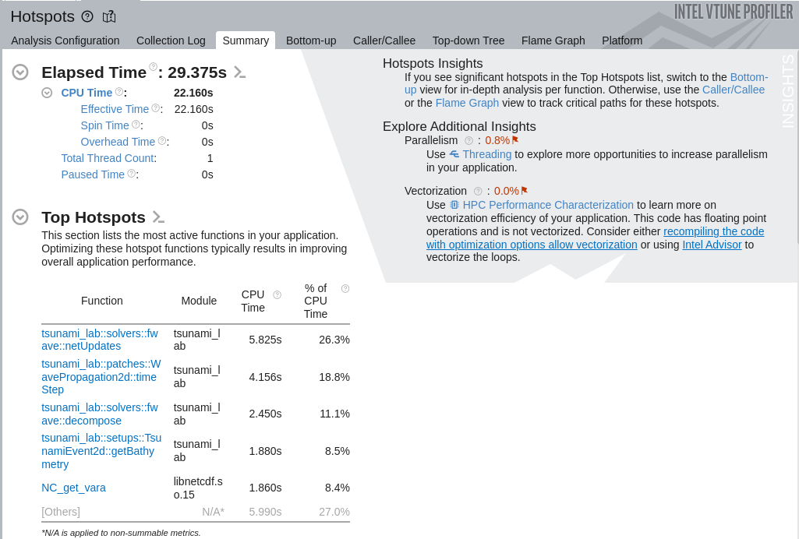
  
  Zusammenfassung: Zeit und Top Hotspots

Hier können wir herauslesen, wie lange das Programm dauerte, was hier 29,375s waren im Gegensatz zum vorherigen Durchlauf über ``salloc`` 
und welche Funktionen, die top Hotspots sind. 

Für unser Programm werden hier auch wieder ``solver::fwave::netUpdates``, ``WavePropagation2d::timeStep``, ``solver::fwave::decompose`` und die ``TsunamiEvent2d::get*`` Funktionen 
als die top Hotspots übergeben. Jedoch hat sich die Reihenfolge bei den Getter-Funktionen etwas verändert.

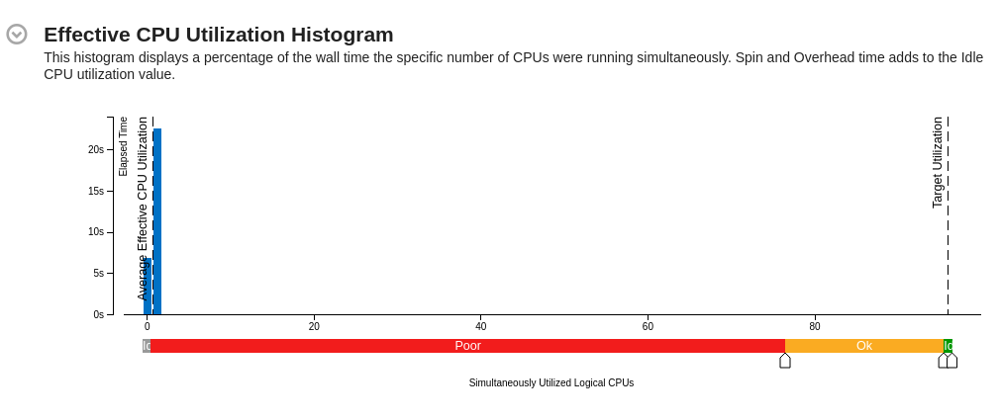
  
  Zusammenfassung: Histogramm von effektiver CPU Nutzung

Hier gibt es keinen Unterschied, da immernoch keine Parallelisierung vorhanden ist.

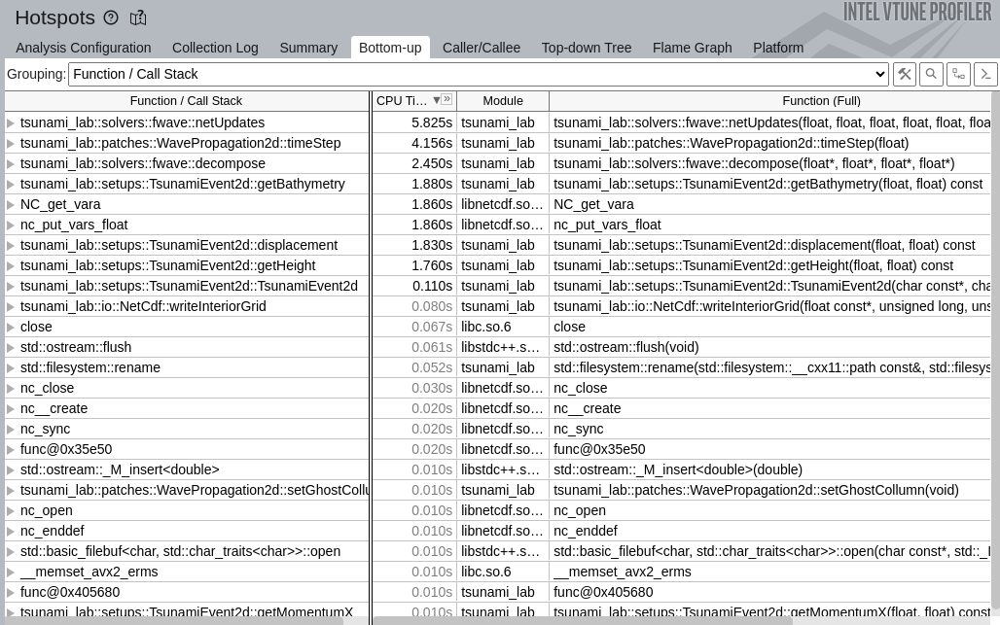
  
  Bottom-Up Graph von den Funktionen und deren CPU Laufzeit

Was hier besonders auffällt, ist das ``nc_put_vars_float`` viel mehr CPU Zeit einnimmt als in der ``salloc`` Analyse. 
Woran das liegt, kann ich mir zunächst nicht erschließen. 

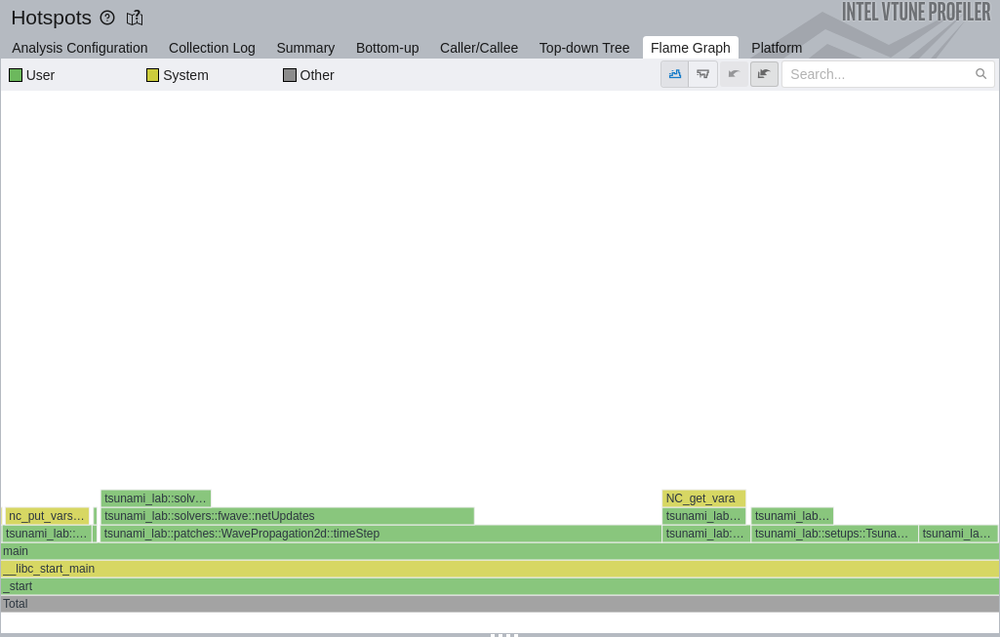
  
  Flame-Graph des Programms

Dieser Graph ist dem Flame-Graph von dem ``salloc`` Durchlauf gleich.

3. Rechenaufwand Erkenntnisse nach Analysen
-------------------------------------------

Was bei den ersten beiden Analysen auffällt sind die Funktionen ``fwave::netUpdates`` und ``WavePropagation::timeStep``. 
Diese beiden Funktionen sind die aktivsten Funktionen in unserem Programm, was zu erwarten war, da sie unsere Zellen berechen.

Demnach wird es hier sehr wichtig sein, Optimierungen zu finden und zu implementieren.

Was etwas überraschender war, aber im nachhinein Sinn ergibt, ist die Aktivität der Getter-Funktionen für Wasserhöhe, die Impulse und Bathymetrie. 
Da wir diese für unsere NetCDF-Dateien bzw. Ausgabe benötigen, ist es verständlich, dass sie so oft aufgerufen werden. 
Diese zu optimieren würde unserem Programm auch helfen.

*Ausführung mit -g*

Danach haben wir nochmal eine Analyse mit Debug Symbolen durchgeführt. 
Dazu haben wir im batch-Skript bei der Kompilierung folgendes ergänzt:

.. code-block:: bash

    scons -g

Dabei haben wir dann folgende Ergebnisse bekommen.

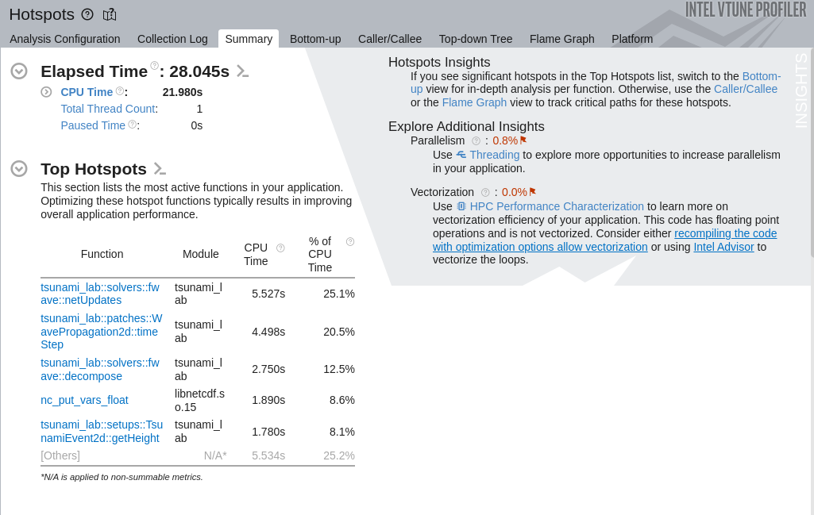
  
  Zusammenfassung: Zeit und Top Hotspots

Die Zeit war wieder anders mit 28,045s etwas schneller als die Durchführung ohne Debug-Symbol ``-g``, jedoch weiterhin langsamer als der ``salloc`` interaktive Job. 

Die top Hotspots waren wie zuvor, was zu erwarten war.

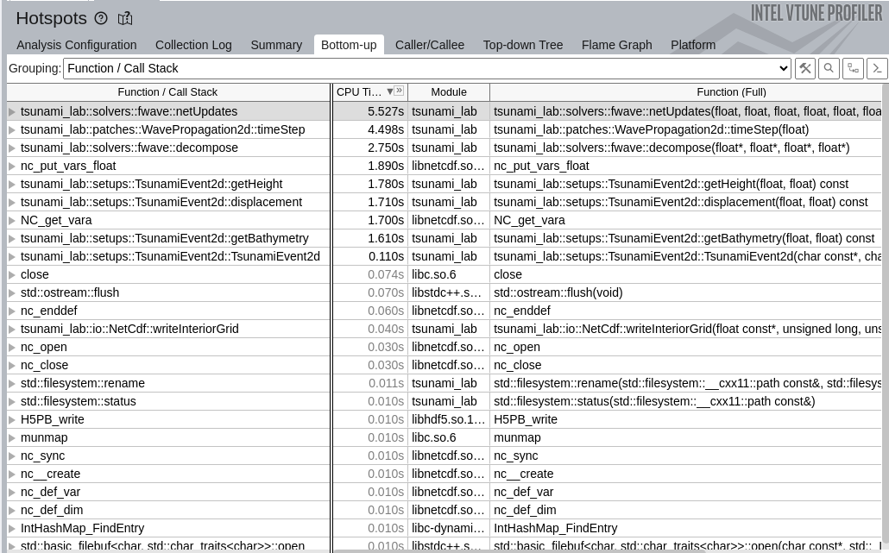
  
  Bottom-Up Graph von den Funktionen und deren CPU Laufzeit

Hier sieht man genauer, dass sich bezüglich der Hotspot-Funktionen nicht viel verändert hat.

*Ausführung mit -g -fno-inline*

Und dann haben wir es auch nocheinmal mit der Ergänzung ``-fno-inline`` durchgeführt.

.. code-block:: bash

    scons -g -fno-inline

Folgend, die Visualiserungen aus VTune:

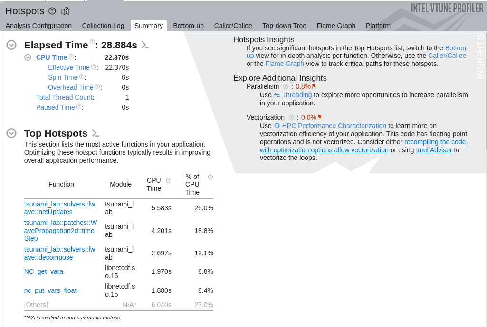
  
  Zusammenfassung: Zeit und Top Hotspots

Zeitlich gesehen gab es wenig Veränderung zu den vorherigen Jobs, diesmal dauerte die Durchführung 28,884s.

Bei den Hotspot-Funktionen gibt es auch keine Veränderung.

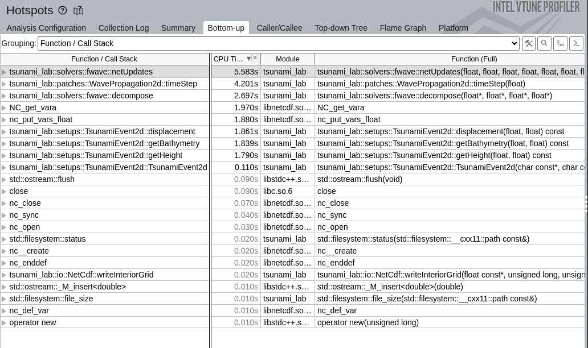
  
  Bottom-Up Graph von den Funktionen und deren CPU Laufzeit

Hier gibt es dann eine große Veränderung gegenüber den vorherigen Analysen: 
aufgrund des ``-fno-inline`` Befehls werden weniger Funktionen in dem Bottom-Up-Graph angezeigt. 

Die Hotspot-Funktionen wurden davon natürlich nicht beeinflusst, jedoch wurden die angegeben Inforamtionen übersichtlicher.

**Zusammenfassung aller Analysen**

Generell dauerten die Simulationen von Tohoku in 3500m Auflösung mit Analyse um die 25 bis 30 Sekunden.

Die herausstechenden Hotspot-Funktionen waren ``fwave::netUpdates`` sowie ``WavePropagation2d::timeStep``. 
Diese Funktionen sollen der Hauptfokus für die Optimierung sein.

4. Verbesserung der Performance
-------------------------------

Wie mittlerweile schon öfter erwähnt, werden wir unser Performance sehr verbessern können durch das Einführen von Paralleliserung.

**Mögliche Verbesserungen in der fwave::netUpdates Funktion**

Da die ``timeStep`` Funktion im jeden Schritt die ``netUpdates`` Funktion aufruft, müssen wir dies bei der Optimierung beachten. 

**Mögliche Verbesserungen in der WavePropagation2d::timeStep Funktion**

